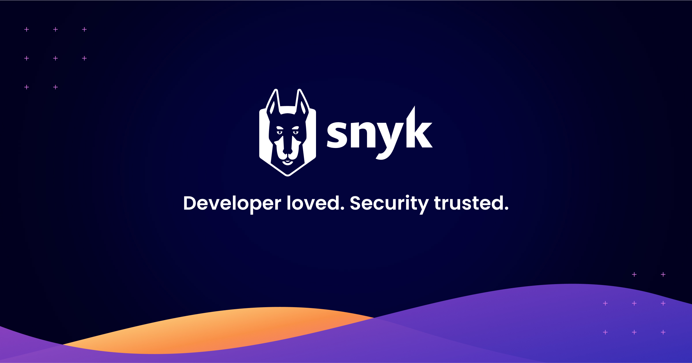

<div align="center">

[](https://docs.snyk.io&#x2F;snyk-api&#x2F;snyk-rest-api-overview)

# Snyk<a id="snyk"></a>

Missing description placeholder


</div>

## Table of Contents<a id="table-of-contents"></a>

<!-- toc -->

- [Requirements](#requirements)
- [Installation](#installation)
- [Getting Started](#getting-started)
- [Async](#async)
- [Raw HTTP Response](#raw-http-response)
- [Reference](#reference)
  * [`snyk.apps.by_install_id`](#snykappsby_install_id)
  * [`snyk.apps.create_install_secret`](#snykappscreate_install_secret)
  * [`snyk.apps.create_new_app_for_organization`](#snykappscreate_new_app_for_organization)
  * [`snyk.apps.create_organization_app`](#snykappscreate_organization_app)
  * [`snyk.apps.delete_app_by_id`](#snykappsdelete_app_by_id)
  * [`snyk.apps.delete_by_app_id`](#snykappsdelete_by_app_id)
  * [`snyk.apps.get_active_sessions`](#snykappsget_active_sessions)
  * [`snyk.apps.get_by_app_id`](#snykappsget_by_app_id)
  * [`snyk.apps.get_by_client_id`](#snykappsget_by_client_id)
  * [`snyk.apps.install_group_app`](#snykappsinstall_group_app)
  * [`snyk.apps.install_snyk_app_to_org`](#snykappsinstall_snyk_app_to_org)
  * [`snyk.apps.list_app_bots`](#snykappslist_app_bots)
  * [`snyk.apps.list_apps`](#snykappslist_apps)
  * [`snyk.apps.list_group_app_installs`](#snykappslist_group_app_installs)
  * [`snyk.apps.list_org_apps`](#snykappslist_org_apps)
  * [`snyk.apps.list_org_creations`](#snykappslist_org_creations)
  * [`snyk.apps.list_org_installs`](#snykappslist_org_installs)
  * [`snyk.apps.list_user_installed_apps`](#snykappslist_user_installed_apps)
  * [`snyk.apps.manage_client_secret_for_snyk_app`](#snykappsmanage_client_secret_for_snyk_app)
  * [`snyk.apps.manage_client_secret_for_snyk_app_0`](#snykappsmanage_client_secret_for_snyk_app_0)
  * [`snyk.apps.manage_client_secrets`](#snykappsmanage_client_secrets)
  * [`snyk.apps.revoke_app_by_id`](#snykappsrevoke_app_by_id)
  * [`snyk.apps.revoke_bot_authorization`](#snykappsrevoke_bot_authorization)
  * [`snyk.apps.revoke_by_install_id`](#snykappsrevoke_by_install_id)
  * [`snyk.apps.revoke_group_app_install`](#snykappsrevoke_group_app_install)
  * [`snyk.apps.revoke_user_app_session`](#snykappsrevoke_user_app_session)
  * [`snyk.apps.update_attributes`](#snykappsupdate_attributes)
  * [`snyk.apps.update_creation_attributes_by_id`](#snykappsupdate_creation_attributes_by_id)
  * [`snyk.audit_logs.search_group_audit_logs`](#snykaudit_logssearch_group_audit_logs)
  * [`snyk.audit_logs.search_organization_audit_logs`](#snykaudit_logssearch_organization_audit_logs)
  * [`snyk.collection.add_projects_to`](#snykcollectionadd_projects_to)
  * [`snyk.collection.create_new`](#snykcollectioncreate_new)
  * [`snyk.collection.edit_collection`](#snykcollectionedit_collection)
  * [`snyk.collection.get_by_id`](#snykcollectionget_by_id)
  * [`snyk.collection.get_list`](#snykcollectionget_list)
  * [`snyk.collection.get_projects`](#snykcollectionget_projects)
  * [`snyk.collection.remove_by_id`](#snykcollectionremove_by_id)
  * [`snyk.collection.remove_projects`](#snykcollectionremove_projects)
  * [`snyk.container_image.get_instance`](#snykcontainer_imageget_instance)
  * [`snyk.container_image.list_image_target_refs`](#snykcontainer_imagelist_image_target_refs)
  * [`snyk.container_image.list_instances_of_container_image`](#snykcontainer_imagelist_instances_of_container_image)
  * [`snyk.custom_base_images.get_by_id`](#snykcustom_base_imagesget_by_id)
  * [`snyk.custom_base_images.list`](#snykcustom_base_imageslist)
  * [`snyk.custom_base_images.mark_image_as_custom_base`](#snykcustom_base_imagesmark_image_as_custom_base)
  * [`snyk.custom_base_images.remove_custom_base_image`](#snykcustom_base_imagesremove_custom_base_image)
  * [`snyk.custom_base_images.update_attributes`](#snykcustom_base_imagesupdate_attributes)
  * [`snyk.iac_settings.get_for_group`](#snykiac_settingsget_for_group)
  * [`snyk.iac_settings.get_for_org_iac`](#snykiac_settingsget_for_org_iac)
  * [`snyk.iac_settings.update_for_group`](#snykiac_settingsupdate_for_group)
  * [`snyk.iac_settings.update_for_org`](#snykiac_settingsupdate_for_org)
  * [`snyk.invites.cancel_pending_invitation`](#snykinvitescancel_pending_invitation)
  * [`snyk.invites.list_pending_user_invitations`](#snykinviteslist_pending_user_invitations)
  * [`snyk.invites.user_to_organization`](#snykinvitesuser_to_organization)
  * [`snyk.issues.by_group_id`](#snykissuesby_group_id)
  * [`snyk.issues.get_by_id`](#snykissuesget_by_id)
  * [`snyk.issues.get_by_issue_id`](#snykissuesget_by_issue_id)
  * [`snyk.issues.list_by_org_id`](#snykissueslist_by_org_id)
  * [`snyk.issues.list_by_package`](#snykissueslist_by_package)
  * [`snyk.issues.query_for_packages`](#snykissuesquery_for_packages)
  * [`snyk.open_api.get_effective_version`](#snykopen_apiget_effective_version)
  * [`snyk.open_api.list_available_versions`](#snykopen_apilist_available_versions)
  * [`snyk.orgs.get_details`](#snykorgsget_details)
  * [`snyk.orgs.list_accessible_organizations`](#snykorgslist_accessible_organizations)
  * [`snyk.orgs.list_group_orgs`](#snykorgslist_group_orgs)
  * [`snyk.orgs.update_details`](#snykorgsupdate_details)
  * [`snyk.projects.delete_by_project_id`](#snykprojectsdelete_by_project_id)
  * [`snyk.projects.get_by_project_id`](#snykprojectsget_by_project_id)
  * [`snyk.projects.list_for_org`](#snykprojectslist_for_org)
  * [`snyk.projects.update_by_project_id`](#snykprojectsupdate_by_project_id)
  * [`snyk.sbom.get_project_document`](#snyksbomget_project_document)
  * [`snyk.sast_settings.get_for_org`](#snyksast_settingsget_for_org)
  * [`snyk.sast_settings.toggle_snyk_code_settings`](#snyksast_settingstoggle_snyk_code_settings)
  * [`snyk.service_accounts.create_for_organization`](#snykservice_accountscreate_for_organization)
  * [`snyk.service_accounts.create_group`](#snykservice_accountscreate_group)
  * [`snyk.service_accounts.delete_group_service_account`](#snykservice_accountsdelete_group_service_account)
  * [`snyk.service_accounts.delete_org_service_account`](#snykservice_accountsdelete_org_service_account)
  * [`snyk.service_accounts.get_group_service_account`](#snykservice_accountsget_group_service_account)
  * [`snyk.service_accounts.get_organization_account_by_id`](#snykservice_accountsget_organization_account_by_id)
  * [`snyk.service_accounts.list_group_service_accounts`](#snykservice_accountslist_group_service_accounts)
  * [`snyk.service_accounts.list_organization_service_accounts`](#snykservice_accountslist_organization_service_accounts)
  * [`snyk.service_accounts.manage_client_secret`](#snykservice_accountsmanage_client_secret)
  * [`snyk.service_accounts.manage_client_secret_for_organization_service_account`](#snykservice_accountsmanage_client_secret_for_organization_service_account)
  * [`snyk.service_accounts.update_group_name_by_id`](#snykservice_accountsupdate_group_name_by_id)
  * [`snyk.service_accounts.update_organization_service_account_name`](#snykservice_accountsupdate_organization_service_account_name)
  * [`snyk.slack.get_channel_name_by_id`](#snykslackget_channel_name_by_id)
  * [`snyk.slack.get_channels`](#snykslackget_channels)
  * [`snyk.slack_settings.create_default_notification_settings`](#snykslack_settingscreate_default_notification_settings)
  * [`snyk.slack_settings.get_default_notification_settings`](#snykslack_settingsget_default_notification_settings)
  * [`snyk.slack_settings.get_overrides_for_projects`](#snykslack_settingsget_overrides_for_projects)
  * [`snyk.slack_settings.project_override`](#snykslack_settingsproject_override)
  * [`snyk.slack_settings.remove_integration`](#snykslack_settingsremove_integration)
  * [`snyk.slack_settings.remove_project_override`](#snykslack_settingsremove_project_override)
  * [`snyk.slack_settings.update_notification_settings_for_project`](#snykslack_settingsupdate_notification_settings_for_project)
  * [`snyk.targets.delete_by_id`](#snyktargetsdelete_by_id)
  * [`snyk.targets.get_by_id`](#snyktargetsget_by_id)
  * [`snyk.targets.list_by_org_id`](#snyktargetslist_by_org_id)

<!-- tocstop -->

## Requirements<a id="requirements"></a>

Python >=3.7

## Installation<a id="installation"></a>
<div align="center">
  <a href="https://konfigthis.com/sdk-sign-up?company=Snyk&language=Python">
    
  </a>
</div>

## Getting Started<a id="getting-started"></a>

```python
from pprint import pprint
from snyk_python_sdk import Snyk, ApiException

snyk = Snyk(api_token="YOUR_API_KEY", access_token="YOUR_BEARER_TOKEN")

try:
    # Revoke app authorization for an Snyk Organization with install ID.
    snyk.apps.by_install_id(
        version="2021-06-04",
        org_id="org_id_example",
        install_id="install_id_example",
    )
except ApiException as e:
    print("Exception when calling AppsApi.by_install_id: %s\n" % e)
    pprint(e.body)
    if e.status == 400:
        pprint(e.body["errors"])
        pprint(e.body["jsonapi"])
    if e.status == 401:
        pprint(e.body["errors"])
        pprint(e.body["jsonapi"])
    if e.status == 500:
        pprint(e.body["errors"])
        pprint(e.body["jsonapi"])
    if e.status == 403:
        pprint(e.body["errors"])
        pprint(e.body["jsonapi"])
    if e.status == 404:
        pprint(e.body["errors"])
        pprint(e.body["jsonapi"])
    if e.status == 409:
        pprint(e.body["errors"])
        pprint(e.body["jsonapi"])
    pprint(e.headers)
    pprint(e.status)
    pprint(e.reason)
    pprint(e.round_trip_time)
```

## Async<a id="async"></a>

`async` support is available by prepending `a` to any method.

```python
import asyncio
from pprint import pprint
from snyk_python_sdk import Snyk, ApiException

snyk = Snyk(api_token="YOUR_API_KEY", access_token="YOUR_BEARER_TOKEN")


async def main():
    try:
        # Revoke app authorization for an Snyk Organization with install ID.
        await snyk.apps.aby_install_id(
            version="2021-06-04",
            org_id="org_id_example",
            install_id="install_id_example",
        )
    except ApiException as e:
        print("Exception when calling AppsApi.by_install_id: %s\n" % e)
        pprint(e.body)
        if e.status == 400:
            pprint(e.body["errors"])
            pprint(e.body["jsonapi"])
        if e.status == 401:
            pprint(e.body["errors"])
            pprint(e.body["jsonapi"])
        if e.status == 500:
            pprint(e.body["errors"])
            pprint(e.body["jsonapi"])
        if e.status == 403:
            pprint(e.body["errors"])
            pprint(e.body["jsonapi"])
        if e.status == 404:
            pprint(e.body["errors"])
            pprint(e.body["jsonapi"])
        if e.status == 409:
            pprint(e.body["errors"])
            pprint(e.body["jsonapi"])
        pprint(e.headers)
        pprint(e.status)
        pprint(e.reason)
        pprint(e.round_trip_time)


asyncio.run(main())
```

## Raw HTTP Response<a id="raw-http-response"></a>

To access raw HTTP response values, use the `.raw` namespace.

```python
from pprint import pprint
from snyk_python_sdk import Snyk, ApiException

snyk = Snyk(api_token="YOUR_API_KEY", access_token="YOUR_BEARER_TOKEN")

try:
    # Revoke app authorization for an Snyk Organization with install ID.
    by_install_id_response = snyk.apps.raw.by_install_id(
        version="2021-06-04",
        org_id="org_id_example",
        install_id="install_id_example",
    )
    pprint(by_install_id_response.headers)
    pprint(by_install_id_response.status)
    pprint(by_install_id_response.round_trip_time)
except ApiException as e:
    print("Exception when calling AppsApi.by_install_id: %s\n" % e)
    pprint(e.body)
    if e.status == 400:
        pprint(e.body["errors"])
        pprint(e.body["jsonapi"])
    if e.status == 401:
        pprint(e.body["errors"])
        pprint(e.body["jsonapi"])
    if e.status == 500:
        pprint(e.body["errors"])
        pprint(e.body["jsonapi"])
    if e.status == 403:
        pprint(e.body["errors"])
        pprint(e.body["jsonapi"])
    if e.status == 404:
        pprint(e.body["errors"])
        pprint(e.body["jsonapi"])
    if e.status == 409:
        pprint(e.body["errors"])
        pprint(e.body["jsonapi"])
    pprint(e.headers)
    pprint(e.status)
    pprint(e.reason)
    pprint(e.round_trip_time)
```


## Reference<a id="reference"></a>
### `snyk.apps.by_install_id`<a id="snykappsby_install_id"></a>

Revoke app authorization for an Snyk Organization with install ID.

#### 🛠️ Usage<a id="🛠️-usage"></a>

```python
snyk.apps.by_install_id(
    version="2021-06-04",
    org_id="org_id_example",
    install_id="install_id_example",
)
```

#### ⚙️ Parameters<a id="⚙️-parameters"></a>

##### version: [`QueryVersion`](./snyk_python_sdk/type/.py)<a id="version-queryversionsnyk_python_sdktypepy"></a>

The requested version of the endpoint to process the request

##### org_id: `str`<a id="org_id-str"></a>

Org ID

##### install_id: `str`<a id="install_id-str"></a>

Install ID

#### 🌐 Endpoint<a id="🌐-endpoint"></a>

`/orgs/{org_id}/apps/installs/{install_id}` `delete`

[🔙 **Back to Table of Contents**](#table-of-contents)

---

### `snyk.apps.create_install_secret`<a id="snykappscreate_install_secret"></a>

Manage client secret for non-interactive Snyk App installations.

#### 🛠️ Usage<a id="🛠️-usage"></a>

```python
create_install_secret_response = snyk.apps.create_install_secret(
    data={
        "attributes": {
            "mode": "replace",
        },
        "type": "app",
    },
    version="2021-06-04",
    group_id="group_id_example",
    install_id="install_id_example",
)
```

#### ⚙️ Parameters<a id="⚙️-parameters"></a>

##### data: [`AppsCreateInstallSecretRequestData`](./snyk_python_sdk/type/apps_create_install_secret_request_data.py)<a id="data-appscreateinstallsecretrequestdatasnyk_python_sdktypeapps_create_install_secret_request_datapy"></a>


##### version: [`QueryVersion`](./snyk_python_sdk/type/.py)<a id="version-queryversionsnyk_python_sdktypepy"></a>

The requested version of the endpoint to process the request

##### group_id: `str`<a id="group_id-str"></a>

Group ID

##### install_id: `str`<a id="install_id-str"></a>

Install ID

#### ⚙️ Request Body<a id="⚙️-request-body"></a>

[`AppsCreateInstallSecretRequest`](./snyk_python_sdk/type/apps_create_install_secret_request.py)
#### 🔄 Return<a id="🔄-return"></a>

[`AppsCreateInstallSecretResponse`](./snyk_python_sdk/pydantic/apps_create_install_secret_response.py)

#### 🌐 Endpoint<a id="🌐-endpoint"></a>

`/groups/{group_id}/apps/installs/{install_id}/secrets` `post`

[🔙 **Back to Table of Contents**](#table-of-contents)

---

### `snyk.apps.create_new_app_for_organization`<a id="snykappscreate_new_app_for_organization"></a>

Create a new Snyk App for an organization.

#### 🛠️ Usage<a id="🛠️-usage"></a>

```python
create_new_app_for_organization_response = snyk.apps.create_new_app_for_organization(
    data={
        "attributes": {
            "access_token_ttl_seconds": 3600,
            "context": "tenant",
            "name": "My App",
            "redirect_uris": ["https://example.com/callback"],
            "scopes": ["scopes_example"],
        },
        "type": "app",
    },
    version="2021-06-04",
    org_id="org_id_example",
)
```

#### ⚙️ Parameters<a id="⚙️-parameters"></a>

##### data: [`AppPostRequestData`](./snyk_python_sdk/type/app_post_request_data.py)<a id="data-apppostrequestdatasnyk_python_sdktypeapp_post_request_datapy"></a>


##### version: [`QueryVersion`](./snyk_python_sdk/type/.py)<a id="version-queryversionsnyk_python_sdktypepy"></a>

The requested version of the endpoint to process the request

##### org_id: `str`<a id="org_id-str"></a>

Org ID

#### ⚙️ Request Body<a id="⚙️-request-body"></a>

[`AppPostRequest`](./snyk_python_sdk/type/app_post_request.py)
Snyk App details for app to be created.

#### 🔄 Return<a id="🔄-return"></a>

[`AppPostResponse`](./snyk_python_sdk/pydantic/app_post_response.py)

#### 🌐 Endpoint<a id="🌐-endpoint"></a>

`/orgs/{org_id}/apps/creations` `post`

[🔙 **Back to Table of Contents**](#table-of-contents)

---

### `snyk.apps.create_organization_app`<a id="snykappscreate_organization_app"></a>

Create a new app for an organization. Deprecated, use /orgs/{org_id}/apps/creations instead.

#### 🛠️ Usage<a id="🛠️-usage"></a>

```python
create_organization_app_response = snyk.apps.create_organization_app(
    data={
        "attributes": {
            "access_token_ttl_seconds": 3600,
            "context": "tenant",
            "name": "My App",
            "redirect_uris": ["https://example.com/callback"],
            "scopes": ["scopes_example"],
        },
        "type": "app",
    },
    version="2021-06-04",
    org_id="org_id_example",
)
```

#### ⚙️ Parameters<a id="⚙️-parameters"></a>

##### data: [`AppPostRequestData`](./snyk_python_sdk/type/app_post_request_data.py)<a id="data-apppostrequestdatasnyk_python_sdktypeapp_post_request_datapy"></a>


##### version: [`QueryVersion`](./snyk_python_sdk/type/.py)<a id="version-queryversionsnyk_python_sdktypepy"></a>

The requested version of the endpoint to process the request

##### org_id: `str`<a id="org_id-str"></a>

Org ID

#### ⚙️ Request Body<a id="⚙️-request-body"></a>

[`AppPostRequest`](./snyk_python_sdk/type/app_post_request.py)
app to be created

#### 🔄 Return<a id="🔄-return"></a>

[`AppPostResponse`](./snyk_python_sdk/pydantic/app_post_response.py)

#### 🌐 Endpoint<a id="🌐-endpoint"></a>

`/orgs/{org_id}/apps` `post`

[🔙 **Back to Table of Contents**](#table-of-contents)

---

### `snyk.apps.delete_app_by_id`<a id="snykappsdelete_app_by_id"></a>

Delete an app by app id. Deprecated, use /orgs/{org_id}/apps/creations/{app_id} instead.

#### 🛠️ Usage<a id="🛠️-usage"></a>

```python
snyk.apps.delete_app_by_id(
    version="2021-06-04",
    org_id="org_id_example",
    client_id="client_id_example",
)
```

#### ⚙️ Parameters<a id="⚙️-parameters"></a>

##### version: [`QueryVersion`](./snyk_python_sdk/type/.py)<a id="version-queryversionsnyk_python_sdktypepy"></a>

The requested version of the endpoint to process the request

##### org_id: `str`<a id="org_id-str"></a>

Org ID

##### client_id: `str`<a id="client_id-str"></a>

Client ID

#### 🌐 Endpoint<a id="🌐-endpoint"></a>

`/orgs/{org_id}/apps/{client_id}` `delete`

[🔙 **Back to Table of Contents**](#table-of-contents)

---

### `snyk.apps.delete_by_app_id`<a id="snykappsdelete_by_app_id"></a>

Delete an app by its App ID.

#### 🛠️ Usage<a id="🛠️-usage"></a>

```python
snyk.apps.delete_by_app_id(
    org_id="org_id_example",
    app_id="app_id_example",
    version="2021-06-04",
)
```

#### ⚙️ Parameters<a id="⚙️-parameters"></a>

##### org_id: `str`<a id="org_id-str"></a>

Org ID

##### app_id: `str`<a id="app_id-str"></a>

App ID

##### version: [`QueryVersion`](./snyk_python_sdk/type/.py)<a id="version-queryversionsnyk_python_sdktypepy"></a>

The requested version of the endpoint to process the request

#### 🌐 Endpoint<a id="🌐-endpoint"></a>

`/orgs/{org_id}/apps/creations/{app_id}` `delete`

[🔙 **Back to Table of Contents**](#table-of-contents)

---

### `snyk.apps.get_active_sessions`<a id="snykappsget_active_sessions"></a>

Get a list of active OAuth sessions for the app.

#### 🛠️ Usage<a id="🛠️-usage"></a>

```python
get_active_sessions_response = snyk.apps.get_active_sessions(
    version="2021-06-04",
    app_id="app_id_example",
    starting_after="v1.eyJpZCI6IjEwMDAifQo=",
    ending_before="v1.eyJpZCI6IjExMDAifQo=",
    limit=10,
)
```

#### ⚙️ Parameters<a id="⚙️-parameters"></a>

##### version: [`QueryVersion`](./snyk_python_sdk/type/.py)<a id="version-queryversionsnyk_python_sdktypepy"></a>

The requested version of the endpoint to process the request

##### app_id: `str`<a id="app_id-str"></a>

App ID

##### starting_after: `str`<a id="starting_after-str"></a>

Return the page of results immediately after this cursor

##### ending_before: `str`<a id="ending_before-str"></a>

Return the page of results immediately before this cursor

##### limit: `int`<a id="limit-int"></a>

Number of results to return per page

#### 🔄 Return<a id="🔄-return"></a>

[`AppsGetActiveSessionsResponse`](./snyk_python_sdk/pydantic/apps_get_active_sessions_response.py)

#### 🌐 Endpoint<a id="🌐-endpoint"></a>

`/self/apps/{app_id}/sessions` `get`

[🔙 **Back to Table of Contents**](#table-of-contents)

---

### `snyk.apps.get_by_app_id`<a id="snykappsget_by_app_id"></a>

Get a Snyk App by its App ID.

#### 🛠️ Usage<a id="🛠️-usage"></a>

```python
get_by_app_id_response = snyk.apps.get_by_app_id(
    org_id="org_id_example",
    app_id="app_id_example",
    version="2021-06-04",
)
```

#### ⚙️ Parameters<a id="⚙️-parameters"></a>

##### org_id: `str`<a id="org_id-str"></a>

Org ID

##### app_id: `str`<a id="app_id-str"></a>

App ID

##### version: [`QueryVersion`](./snyk_python_sdk/type/.py)<a id="version-queryversionsnyk_python_sdktypepy"></a>

The requested version of the endpoint to process the request

#### 🔄 Return<a id="🔄-return"></a>

[`AppsGetByAppIdResponse`](./snyk_python_sdk/pydantic/apps_get_by_app_id_response.py)

#### 🌐 Endpoint<a id="🌐-endpoint"></a>

`/orgs/{org_id}/apps/creations/{app_id}` `get`

[🔙 **Back to Table of Contents**](#table-of-contents)

---

### `snyk.apps.get_by_client_id`<a id="snykappsget_by_client_id"></a>

Get an App by client id. Deprecated, use /orgs/{org_id}/apps/creations/{app_id} instead.

#### 🛠️ Usage<a id="🛠️-usage"></a>

```python
get_by_client_id_response = snyk.apps.get_by_client_id(
    org_id="org_id_example",
    client_id="client_id_example",
    version="2021-06-04",
)
```

#### ⚙️ Parameters<a id="⚙️-parameters"></a>

##### org_id: `str`<a id="org_id-str"></a>

Org ID

##### client_id: `str`<a id="client_id-str"></a>

Client ID

##### version: [`QueryVersion`](./snyk_python_sdk/type/.py)<a id="version-queryversionsnyk_python_sdktypepy"></a>

The requested version of the endpoint to process the request

#### 🔄 Return<a id="🔄-return"></a>

[`AppsGetByClientIdResponse`](./snyk_python_sdk/pydantic/apps_get_by_client_id_response.py)

#### 🌐 Endpoint<a id="🌐-endpoint"></a>

`/orgs/{org_id}/apps/{client_id}` `get`

[🔙 **Back to Table of Contents**](#table-of-contents)

---

### `snyk.apps.install_group_app`<a id="snykappsinstall_group_app"></a>

Install a Snyk Apps to this group, the Snyk App must use unattended authentication eg client credentials.

#### 🛠️ Usage<a id="🛠️-usage"></a>

```python
install_group_app_response = snyk.apps.install_group_app(
    data={
        "type": "app_install",
    },
    relationships={
        "app": {
            "data": {
                "id": "id_example",
                "type": "app",
            },
        },
    },
    version="2021-06-04",
    group_id="group_id_example",
)
```

#### ⚙️ Parameters<a id="⚙️-parameters"></a>

##### data: [`AppsInstallGroupAppRequestData`](./snyk_python_sdk/type/apps_install_group_app_request_data.py)<a id="data-appsinstallgroupapprequestdatasnyk_python_sdktypeapps_install_group_app_request_datapy"></a>


##### relationships: [`AppsInstallGroupAppRequestRelationships`](./snyk_python_sdk/type/apps_install_group_app_request_relationships.py)<a id="relationships-appsinstallgroupapprequestrelationshipssnyk_python_sdktypeapps_install_group_app_request_relationshipspy"></a>


##### version: [`QueryVersion`](./snyk_python_sdk/type/.py)<a id="version-queryversionsnyk_python_sdktypepy"></a>

The requested version of the endpoint to process the request

##### group_id: `str`<a id="group_id-str"></a>

Group ID

#### ⚙️ Request Body<a id="⚙️-request-body"></a>

[`AppsInstallGroupAppRequest`](./snyk_python_sdk/type/apps_install_group_app_request.py)
App Install to be created

#### 🔄 Return<a id="🔄-return"></a>

[`AppsInstallGroupAppResponse`](./snyk_python_sdk/pydantic/apps_install_group_app_response.py)

#### 🌐 Endpoint<a id="🌐-endpoint"></a>

`/groups/{group_id}/apps/installs` `post`

[🔙 **Back to Table of Contents**](#table-of-contents)

---

### `snyk.apps.install_snyk_app_to_org`<a id="snykappsinstall_snyk_app_to_org"></a>

Install a Snyk Apps to this organization, the Snyk App must use unattended authentication eg client credentials.

#### 🛠️ Usage<a id="🛠️-usage"></a>

```python
install_snyk_app_to_org_response = snyk.apps.install_snyk_app_to_org(
    data={
        "type": "app_install",
    },
    relationships={
        "app": {
            "data": {
                "id": "id_example",
                "type": "app",
            },
        },
    },
    version="2021-06-04",
    org_id="org_id_example",
)
```

#### ⚙️ Parameters<a id="⚙️-parameters"></a>

##### data: [`AppsInstallSnykAppToOrgRequestData`](./snyk_python_sdk/type/apps_install_snyk_app_to_org_request_data.py)<a id="data-appsinstallsnykapptoorgrequestdatasnyk_python_sdktypeapps_install_snyk_app_to_org_request_datapy"></a>


##### relationships: [`AppsInstallSnykAppToOrgRequestRelationships`](./snyk_python_sdk/type/apps_install_snyk_app_to_org_request_relationships.py)<a id="relationships-appsinstallsnykapptoorgrequestrelationshipssnyk_python_sdktypeapps_install_snyk_app_to_org_request_relationshipspy"></a>


##### version: [`QueryVersion`](./snyk_python_sdk/type/.py)<a id="version-queryversionsnyk_python_sdktypepy"></a>

The requested version of the endpoint to process the request

##### org_id: `str`<a id="org_id-str"></a>

Org ID

#### ⚙️ Request Body<a id="⚙️-request-body"></a>

[`AppsInstallSnykAppToOrgRequest`](./snyk_python_sdk/type/apps_install_snyk_app_to_org_request.py)
App Install to be created

#### 🔄 Return<a id="🔄-return"></a>

[`AppsInstallSnykAppToOrgResponse`](./snyk_python_sdk/pydantic/apps_install_snyk_app_to_org_response.py)

#### 🌐 Endpoint<a id="🌐-endpoint"></a>

`/orgs/{org_id}/apps/installs` `post`

[🔙 **Back to Table of Contents**](#table-of-contents)

---

### `snyk.apps.list_app_bots`<a id="snykappslist_app_bots"></a>

Get a list of app bots authorized to an organization. Deprecated, use /orgs/{org_id}/apps/installs instead.

#### 🛠️ Usage<a id="🛠️-usage"></a>

```python
list_app_bots_response = snyk.apps.list_app_bots(
    org_id="org_id_example",
    version="2021-06-04",
    expand=["string_example"],
    starting_after="v1.eyJpZCI6IjEwMDAifQo=",
    ending_before="v1.eyJpZCI6IjExMDAifQo=",
    limit=10,
)
```

#### ⚙️ Parameters<a id="⚙️-parameters"></a>

##### org_id: `str`<a id="org_id-str"></a>

Org ID

##### version: [`QueryVersion`](./snyk_python_sdk/type/.py)<a id="version-queryversionsnyk_python_sdktypepy"></a>

The requested version of the endpoint to process the request

##### expand: List[`str`]<a id="expand-liststr"></a>

Expand relationships.

##### starting_after: `str`<a id="starting_after-str"></a>

Return the page of results immediately after this cursor

##### ending_before: `str`<a id="ending_before-str"></a>

Return the page of results immediately before this cursor

##### limit: `int`<a id="limit-int"></a>

Number of results to return per page

#### 🔄 Return<a id="🔄-return"></a>

[`AppsListAppBotsResponse`](./snyk_python_sdk/pydantic/apps_list_app_bots_response.py)

#### 🌐 Endpoint<a id="🌐-endpoint"></a>

`/orgs/{org_id}/app_bots` `get`

[🔙 **Back to Table of Contents**](#table-of-contents)

---

### `snyk.apps.list_apps`<a id="snykappslist_apps"></a>

Get a list of apps that can act on your behalf.

#### 🛠️ Usage<a id="🛠️-usage"></a>

```python
list_apps_response = snyk.apps.list_apps(
    version="2021-06-04",
    starting_after="v1.eyJpZCI6IjEwMDAifQo=",
    ending_before="v1.eyJpZCI6IjExMDAifQo=",
    limit=10,
)
```

#### ⚙️ Parameters<a id="⚙️-parameters"></a>

##### version: [`QueryVersion`](./snyk_python_sdk/type/.py)<a id="version-queryversionsnyk_python_sdktypepy"></a>

The requested version of the endpoint to process the request

##### starting_after: `str`<a id="starting_after-str"></a>

Return the page of results immediately after this cursor

##### ending_before: `str`<a id="ending_before-str"></a>

Return the page of results immediately before this cursor

##### limit: `int`<a id="limit-int"></a>

Number of results to return per page

#### 🔄 Return<a id="🔄-return"></a>

[`AppsListAppsResponse`](./snyk_python_sdk/pydantic/apps_list_apps_response.py)

#### 🌐 Endpoint<a id="🌐-endpoint"></a>

`/self/apps` `get`

[🔙 **Back to Table of Contents**](#table-of-contents)

---

### `snyk.apps.list_group_app_installs`<a id="snykappslist_group_app_installs"></a>

Get a list of apps installed for a group.

#### 🛠️ Usage<a id="🛠️-usage"></a>

```python
list_group_app_installs_response = snyk.apps.list_group_app_installs(
    group_id="group_id_example",
    version="2021-06-04",
    expand=["string_example"],
    starting_after="v1.eyJpZCI6IjEwMDAifQo=",
    ending_before="v1.eyJpZCI6IjExMDAifQo=",
    limit=10,
)
```

#### ⚙️ Parameters<a id="⚙️-parameters"></a>

##### group_id: `str`<a id="group_id-str"></a>

Group ID

##### version: [`QueryVersion`](./snyk_python_sdk/type/.py)<a id="version-queryversionsnyk_python_sdktypepy"></a>

The requested version of the endpoint to process the request

##### expand: List[`str`]<a id="expand-liststr"></a>

Expand relationships.

##### starting_after: `str`<a id="starting_after-str"></a>

Return the page of results immediately after this cursor

##### ending_before: `str`<a id="ending_before-str"></a>

Return the page of results immediately before this cursor

##### limit: `int`<a id="limit-int"></a>

Number of results to return per page

#### 🔄 Return<a id="🔄-return"></a>

[`AppsListGroupAppInstallsResponse`](./snyk_python_sdk/pydantic/apps_list_group_app_installs_response.py)

#### 🌐 Endpoint<a id="🌐-endpoint"></a>

`/groups/{group_id}/apps/installs` `get`

[🔙 **Back to Table of Contents**](#table-of-contents)

---

### `snyk.apps.list_org_apps`<a id="snykappslist_org_apps"></a>

Get a list of apps created by an organization. Deprecated, use /orgs/{org_id}/apps/creations instead.

#### 🛠️ Usage<a id="🛠️-usage"></a>

```python
list_org_apps_response = snyk.apps.list_org_apps(
    org_id="org_id_example",
    version="2021-06-04",
    starting_after="v1.eyJpZCI6IjEwMDAifQo=",
    ending_before="v1.eyJpZCI6IjExMDAifQo=",
    limit=10,
)
```

#### ⚙️ Parameters<a id="⚙️-parameters"></a>

##### org_id: `str`<a id="org_id-str"></a>

Org ID

##### version: [`QueryVersion`](./snyk_python_sdk/type/.py)<a id="version-queryversionsnyk_python_sdktypepy"></a>

The requested version of the endpoint to process the request

##### starting_after: `str`<a id="starting_after-str"></a>

Return the page of results immediately after this cursor

##### ending_before: `str`<a id="ending_before-str"></a>

Return the page of results immediately before this cursor

##### limit: `int`<a id="limit-int"></a>

Number of results to return per page

#### 🔄 Return<a id="🔄-return"></a>

[`AppsListOrgAppsResponse`](./snyk_python_sdk/pydantic/apps_list_org_apps_response.py)

#### 🌐 Endpoint<a id="🌐-endpoint"></a>

`/orgs/{org_id}/apps` `get`

[🔙 **Back to Table of Contents**](#table-of-contents)

---

### `snyk.apps.list_org_creations`<a id="snykappslist_org_creations"></a>

Get a list of apps created by an organization.

#### 🛠️ Usage<a id="🛠️-usage"></a>

```python
list_org_creations_response = snyk.apps.list_org_creations(
    org_id="org_id_example",
    version="2021-06-04",
    starting_after="v1.eyJpZCI6IjEwMDAifQo=",
    ending_before="v1.eyJpZCI6IjExMDAifQo=",
    limit=10,
)
```

#### ⚙️ Parameters<a id="⚙️-parameters"></a>

##### org_id: `str`<a id="org_id-str"></a>

Org ID

##### version: [`QueryVersion`](./snyk_python_sdk/type/.py)<a id="version-queryversionsnyk_python_sdktypepy"></a>

The requested version of the endpoint to process the request

##### starting_after: `str`<a id="starting_after-str"></a>

Return the page of results immediately after this cursor

##### ending_before: `str`<a id="ending_before-str"></a>

Return the page of results immediately before this cursor

##### limit: `int`<a id="limit-int"></a>

Number of results to return per page

#### 🔄 Return<a id="🔄-return"></a>

[`AppsListOrgCreationsResponse`](./snyk_python_sdk/pydantic/apps_list_org_creations_response.py)

#### 🌐 Endpoint<a id="🌐-endpoint"></a>

`/orgs/{org_id}/apps/creations` `get`

[🔙 **Back to Table of Contents**](#table-of-contents)

---

### `snyk.apps.list_org_installs`<a id="snykappslist_org_installs"></a>

Get a list of apps installed for an organization.

#### 🛠️ Usage<a id="🛠️-usage"></a>

```python
list_org_installs_response = snyk.apps.list_org_installs(
    org_id="org_id_example",
    version="2021-06-04",
    expand=["string_example"],
    starting_after="v1.eyJpZCI6IjEwMDAifQo=",
    ending_before="v1.eyJpZCI6IjExMDAifQo=",
    limit=10,
)
```

#### ⚙️ Parameters<a id="⚙️-parameters"></a>

##### org_id: `str`<a id="org_id-str"></a>

Org ID

##### version: [`QueryVersion`](./snyk_python_sdk/type/.py)<a id="version-queryversionsnyk_python_sdktypepy"></a>

The requested version of the endpoint to process the request

##### expand: List[`str`]<a id="expand-liststr"></a>

Expand relationships.

##### starting_after: `str`<a id="starting_after-str"></a>

Return the page of results immediately after this cursor

##### ending_before: `str`<a id="ending_before-str"></a>

Return the page of results immediately before this cursor

##### limit: `int`<a id="limit-int"></a>

Number of results to return per page

#### 🔄 Return<a id="🔄-return"></a>

[`AppsListOrgInstallsResponse`](./snyk_python_sdk/pydantic/apps_list_org_installs_response.py)

#### 🌐 Endpoint<a id="🌐-endpoint"></a>

`/orgs/{org_id}/apps/installs` `get`

[🔙 **Back to Table of Contents**](#table-of-contents)

---

### `snyk.apps.list_user_installed_apps`<a id="snykappslist_user_installed_apps"></a>

Get a list of apps installed for an user.

#### 🛠️ Usage<a id="🛠️-usage"></a>

```python
list_user_installed_apps_response = snyk.apps.list_user_installed_apps(
    version="2021-06-04",
    expand=["string_example"],
    starting_after="v1.eyJpZCI6IjEwMDAifQo=",
    ending_before="v1.eyJpZCI6IjExMDAifQo=",
    limit=10,
)
```

#### ⚙️ Parameters<a id="⚙️-parameters"></a>

##### version: [`QueryVersion`](./snyk_python_sdk/type/.py)<a id="version-queryversionsnyk_python_sdktypepy"></a>

The requested version of the endpoint to process the request

##### expand: List[`str`]<a id="expand-liststr"></a>

Expand relationships.

##### starting_after: `str`<a id="starting_after-str"></a>

Return the page of results immediately after this cursor

##### ending_before: `str`<a id="ending_before-str"></a>

Return the page of results immediately before this cursor

##### limit: `int`<a id="limit-int"></a>

Number of results to return per page

#### 🔄 Return<a id="🔄-return"></a>

[`AppsListUserInstalledAppsResponse`](./snyk_python_sdk/pydantic/apps_list_user_installed_apps_response.py)

#### 🌐 Endpoint<a id="🌐-endpoint"></a>

`/self/apps/installs` `get`

[🔙 **Back to Table of Contents**](#table-of-contents)

---

### `snyk.apps.manage_client_secret_for_snyk_app`<a id="snykappsmanage_client_secret_for_snyk_app"></a>

Manage client secret for the Snyk App.

#### 🛠️ Usage<a id="🛠️-usage"></a>

```python
manage_client_secret_for_snyk_app_response = (
    snyk.apps.manage_client_secret_for_snyk_app(
        data={
            "attributes": {
                "mode": "replace",
            },
            "type": "app",
        },
        version="2021-06-04",
        org_id="org_id_example",
        app_id="app_id_example",
    )
)
```

#### ⚙️ Parameters<a id="⚙️-parameters"></a>

##### data: [`AppsManageClientSecretForSnykAppRequestData`](./snyk_python_sdk/type/apps_manage_client_secret_for_snyk_app_request_data.py)<a id="data-appsmanageclientsecretforsnykapprequestdatasnyk_python_sdktypeapps_manage_client_secret_for_snyk_app_request_datapy"></a>


##### version: [`QueryVersion`](./snyk_python_sdk/type/.py)<a id="version-queryversionsnyk_python_sdktypepy"></a>

The requested version of the endpoint to process the request

##### org_id: `str`<a id="org_id-str"></a>

Org ID

##### app_id: `str`<a id="app_id-str"></a>

App ID

#### ⚙️ Request Body<a id="⚙️-request-body"></a>

[`AppsManageClientSecretForSnykAppRequest`](./snyk_python_sdk/type/apps_manage_client_secret_for_snyk_app_request.py)
#### 🔄 Return<a id="🔄-return"></a>

[`AppsManageClientSecretForSnykAppResponse`](./snyk_python_sdk/pydantic/apps_manage_client_secret_for_snyk_app_response.py)

#### 🌐 Endpoint<a id="🌐-endpoint"></a>

`/orgs/{org_id}/apps/creations/{app_id}/secrets` `post`

[🔙 **Back to Table of Contents**](#table-of-contents)

---

### `snyk.apps.manage_client_secret_for_snyk_app_0`<a id="snykappsmanage_client_secret_for_snyk_app_0"></a>

Manage client secret for non-interactive Snyk App installations.

#### 🛠️ Usage<a id="🛠️-usage"></a>

```python
manage_client_secret_for_snyk_app_0_response = (
    snyk.apps.manage_client_secret_for_snyk_app_0(
        data={
            "attributes": {
                "mode": "replace",
            },
            "type": "app",
        },
        version="2021-06-04",
        org_id="org_id_example",
        install_id="install_id_example",
    )
)
```

#### ⚙️ Parameters<a id="⚙️-parameters"></a>

##### data: [`AppsManageClientSecretForSnykAppRequest1Data`](./snyk_python_sdk/type/apps_manage_client_secret_for_snyk_app_request1_data.py)<a id="data-appsmanageclientsecretforsnykapprequest1datasnyk_python_sdktypeapps_manage_client_secret_for_snyk_app_request1_datapy"></a>


##### version: [`QueryVersion`](./snyk_python_sdk/type/.py)<a id="version-queryversionsnyk_python_sdktypepy"></a>

The requested version of the endpoint to process the request

##### org_id: `str`<a id="org_id-str"></a>

Org ID

##### install_id: `str`<a id="install_id-str"></a>

Install ID

#### ⚙️ Request Body<a id="⚙️-request-body"></a>

[`AppsManageClientSecretForSnykAppRequest1`](./snyk_python_sdk/type/apps_manage_client_secret_for_snyk_app_request1.py)
#### 🔄 Return<a id="🔄-return"></a>

[`AppsManageClientSecretForSnykApp200Response`](./snyk_python_sdk/pydantic/apps_manage_client_secret_for_snyk_app200_response.py)

#### 🌐 Endpoint<a id="🌐-endpoint"></a>

`/orgs/{org_id}/apps/installs/{install_id}/secrets` `post`

[🔙 **Back to Table of Contents**](#table-of-contents)

---

### `snyk.apps.manage_client_secrets`<a id="snykappsmanage_client_secrets"></a>

Manage client secrets for an app. Deprecated, use /orgs/{org_id}/apps/creations/{app_id}/secrets instead.

#### 🛠️ Usage<a id="🛠️-usage"></a>

```python
manage_client_secrets_response = snyk.apps.manage_client_secrets(
    mode="replace",
    version="2021-06-04",
    org_id="org_id_example",
    client_id="client_id_example",
    secret="string_example",
)
```

#### ⚙️ Parameters<a id="⚙️-parameters"></a>

##### mode: `str`<a id="mode-str"></a>

Operation to perform:   * `replace` - Replace existing secrets with a new generated secret   * `create` - Add a new secret, preserving existing secrets   * `delete` - Remove an existing secret by value 

##### version: [`QueryVersion`](./snyk_python_sdk/type/.py)<a id="version-queryversionsnyk_python_sdktypepy"></a>

The requested version of the endpoint to process the request

##### org_id: `str`<a id="org_id-str"></a>

Org ID

##### client_id: `str`<a id="client_id-str"></a>

Client ID

##### secret: `str`<a id="secret-str"></a>

Secret to delete when using `delete` mode

#### ⚙️ Request Body<a id="⚙️-request-body"></a>

[`AppsManageClientSecretsRequest`](./snyk_python_sdk/type/apps_manage_client_secrets_request.py)
#### 🔄 Return<a id="🔄-return"></a>

[`AppsManageClientSecretsResponse`](./snyk_python_sdk/pydantic/apps_manage_client_secrets_response.py)

#### 🌐 Endpoint<a id="🌐-endpoint"></a>

`/orgs/{org_id}/apps/{client_id}/secrets` `post`

[🔙 **Back to Table of Contents**](#table-of-contents)

---

### `snyk.apps.revoke_app_by_id`<a id="snykappsrevoke_app_by_id"></a>

Revoke access for an app by app id

#### 🛠️ Usage<a id="🛠️-usage"></a>

```python
snyk.apps.revoke_app_by_id(
    version="2021-06-04",
    app_id="app_id_example",
)
```

#### ⚙️ Parameters<a id="⚙️-parameters"></a>

##### version: [`QueryVersion`](./snyk_python_sdk/type/.py)<a id="version-queryversionsnyk_python_sdktypepy"></a>

The requested version of the endpoint to process the request

##### app_id: `str`<a id="app_id-str"></a>

App ID

#### 🌐 Endpoint<a id="🌐-endpoint"></a>

`/self/apps/{app_id}` `delete`

[🔙 **Back to Table of Contents**](#table-of-contents)

---

### `snyk.apps.revoke_bot_authorization`<a id="snykappsrevoke_bot_authorization"></a>

Revoke app bot authorization. Deprecated, use /orgs/{org_id}/apps/installs/{install_id} instead.

#### 🛠️ Usage<a id="🛠️-usage"></a>

```python
snyk.apps.revoke_bot_authorization(
    bot_id="bot_id_example",
    version="2021-06-04",
    org_id="org_id_example",
)
```

#### ⚙️ Parameters<a id="⚙️-parameters"></a>

##### bot_id: `str`<a id="bot_id-str"></a>

The ID of the app bot

##### version: [`QueryVersion`](./snyk_python_sdk/type/.py)<a id="version-queryversionsnyk_python_sdktypepy"></a>

The requested version of the endpoint to process the request

##### org_id: `str`<a id="org_id-str"></a>

Org ID

#### 🌐 Endpoint<a id="🌐-endpoint"></a>

`/orgs/{org_id}/app_bots/{bot_id}` `delete`

[🔙 **Back to Table of Contents**](#table-of-contents)

---

### `snyk.apps.revoke_by_install_id`<a id="snykappsrevoke_by_install_id"></a>

Revoke access for an app by install ID.

#### 🛠️ Usage<a id="🛠️-usage"></a>

```python
snyk.apps.revoke_by_install_id(
    version="2021-06-04",
    install_id="install_id_example",
)
```

#### ⚙️ Parameters<a id="⚙️-parameters"></a>

##### version: [`QueryVersion`](./snyk_python_sdk/type/.py)<a id="version-queryversionsnyk_python_sdktypepy"></a>

The requested version of the endpoint to process the request

##### install_id: `str`<a id="install_id-str"></a>

Install ID

#### 🌐 Endpoint<a id="🌐-endpoint"></a>

`/self/apps/installs/{install_id}` `delete`

[🔙 **Back to Table of Contents**](#table-of-contents)

---

### `snyk.apps.revoke_group_app_install`<a id="snykappsrevoke_group_app_install"></a>

Revoke app authorization for an Snyk Group with install ID.

#### 🛠️ Usage<a id="🛠️-usage"></a>

```python
snyk.apps.revoke_group_app_install(
    version="2021-06-04",
    group_id="group_id_example",
    install_id="install_id_example",
)
```

#### ⚙️ Parameters<a id="⚙️-parameters"></a>

##### version: [`QueryVersion`](./snyk_python_sdk/type/.py)<a id="version-queryversionsnyk_python_sdktypepy"></a>

The requested version of the endpoint to process the request

##### group_id: `str`<a id="group_id-str"></a>

Group ID

##### install_id: `str`<a id="install_id-str"></a>

Install ID

#### 🌐 Endpoint<a id="🌐-endpoint"></a>

`/groups/{group_id}/apps/installs/{install_id}` `delete`

[🔙 **Back to Table of Contents**](#table-of-contents)

---

### `snyk.apps.revoke_user_app_session`<a id="snykappsrevoke_user_app_session"></a>

Revoke an active user app session.

#### 🛠️ Usage<a id="🛠️-usage"></a>

```python
snyk.apps.revoke_user_app_session(
    version="2021-06-04",
    app_id="app_id_example",
    session_id="session_id_example",
)
```

#### ⚙️ Parameters<a id="⚙️-parameters"></a>

##### version: [`QueryVersion`](./snyk_python_sdk/type/.py)<a id="version-queryversionsnyk_python_sdktypepy"></a>

The requested version of the endpoint to process the request

##### app_id: `str`<a id="app_id-str"></a>

App ID

##### session_id: `str`<a id="session_id-str"></a>

Session ID

#### 🌐 Endpoint<a id="🌐-endpoint"></a>

`/self/apps/{app_id}/sessions/{session_id}` `delete`

[🔙 **Back to Table of Contents**](#table-of-contents)

---

### `snyk.apps.update_attributes`<a id="snykappsupdate_attributes"></a>

Update app attributes. Deprecated, use /orgs/{org_id}/apps/creations/{app_id} instead.

#### 🛠️ Usage<a id="🛠️-usage"></a>

```python
update_attributes_response = snyk.apps.update_attributes(
    data={
        "type": "app",
    },
    version="2021-06-04",
    org_id="org_id_example",
    client_id="client_id_example",
)
```

#### ⚙️ Parameters<a id="⚙️-parameters"></a>

##### data: [`AppPatchRequestData`](./snyk_python_sdk/type/app_patch_request_data.py)<a id="data-apppatchrequestdatasnyk_python_sdktypeapp_patch_request_datapy"></a>


##### version: [`QueryVersion`](./snyk_python_sdk/type/.py)<a id="version-queryversionsnyk_python_sdktypepy"></a>

The requested version of the endpoint to process the request

##### org_id: `str`<a id="org_id-str"></a>

Org ID

##### client_id: `str`<a id="client_id-str"></a>

Client ID

#### ⚙️ Request Body<a id="⚙️-request-body"></a>

[`AppPatchRequest`](./snyk_python_sdk/type/app_patch_request.py)
#### 🔄 Return<a id="🔄-return"></a>

[`AppsUpdateAttributesResponse`](./snyk_python_sdk/pydantic/apps_update_attributes_response.py)

#### 🌐 Endpoint<a id="🌐-endpoint"></a>

`/orgs/{org_id}/apps/{client_id}` `patch`

[🔙 **Back to Table of Contents**](#table-of-contents)

---

### `snyk.apps.update_creation_attributes_by_id`<a id="snykappsupdate_creation_attributes_by_id"></a>

Update app creation attributes with App ID.

#### 🛠️ Usage<a id="🛠️-usage"></a>

```python
update_creation_attributes_by_id_response = snyk.apps.update_creation_attributes_by_id(
    data={
        "type": "app",
    },
    version="2021-06-04",
    org_id="org_id_example",
    app_id="app_id_example",
)
```

#### ⚙️ Parameters<a id="⚙️-parameters"></a>

##### data: [`AppPatchRequestData`](./snyk_python_sdk/type/app_patch_request_data.py)<a id="data-apppatchrequestdatasnyk_python_sdktypeapp_patch_request_datapy"></a>


##### version: [`QueryVersion`](./snyk_python_sdk/type/.py)<a id="version-queryversionsnyk_python_sdktypepy"></a>

The requested version of the endpoint to process the request

##### org_id: `str`<a id="org_id-str"></a>

Org ID

##### app_id: `str`<a id="app_id-str"></a>

App ID

#### ⚙️ Request Body<a id="⚙️-request-body"></a>

[`AppPatchRequest`](./snyk_python_sdk/type/app_patch_request.py)
#### 🔄 Return<a id="🔄-return"></a>

[`AppsUpdateCreationAttributesByIdResponse`](./snyk_python_sdk/pydantic/apps_update_creation_attributes_by_id_response.py)

#### 🌐 Endpoint<a id="🌐-endpoint"></a>

`/orgs/{org_id}/apps/creations/{app_id}` `patch`

[🔙 **Back to Table of Contents**](#table-of-contents)

---

### `snyk.audit_logs.search_group_audit_logs`<a id="snykaudit_logssearch_group_audit_logs"></a>

Search audit logs for a Group. Some Organization level events are supported as well as the following
Group level events:
  - api.access
  - group.cloud_config.settings.edit
  - group.create
  - group.delete
  - group.edit
  - group.notification_settings.edit
  - group.org.add
  - group.org.remove
  - group.policy.create
  - group.policy.delete
  - group.policy.edit
  - group.request_access_settings.edit
  - group.role.create
  - group.role.delete
  - group.role.edit
  - group.service_account.create
  - group.service_account.delete
  - group.service_account.edit
  - group.settings.edit
  - group.settings.feature_flag.edit
  - group.sso.add
  - group.sso.auth0_connection.create
  - group.sso.auth0_connection.edit
  - group.sso.create
  - group.sso.delete
  - group.sso.edit
  - group.sso.membership.sync
  - group.sso.remove
  - group.tag.create
  - group.tag.delete
  - group.user.add
  - group.user.remove
  - group.user.role.edit


#### 🛠️ Usage<a id="🛠️-usage"></a>

```python
search_group_audit_logs_response = snyk.audit_logs.search_group_audit_logs(
    version="2021-06-04",
    group_id="0d3728ec-eebf-484d-9907-ba238019f10b",
    cursor="string_example",
    _from="1970-01-01",
    to="1970-01-01",
    size=10,
    sort_order="ASC",
    user_id="0d3728ec-eebf-484d-9907-ba238019f10b",
    project_id="0d3728ec-eebf-484d-9907-ba238019f10b",
    event="api.access",
    exclude_event="api.access",
)
```

#### ⚙️ Parameters<a id="⚙️-parameters"></a>

##### version: [`QueryVersion`](./snyk_python_sdk/type/.py)<a id="version-queryversionsnyk_python_sdktypepy"></a>

The requested version of the endpoint to process the request

##### group_id: `str`<a id="group_id-str"></a>

The ID of the Group.

##### cursor: `str`<a id="cursor-str"></a>

The ID for the next page of results.

##### _from: `date`<a id="_from-date"></a>

The start date (inclusive) of the audit logs search. Example: 2023-07-27 

##### to: `date`<a id="to-date"></a>

The end date (inclusive) of the audit logs search. Example: 2023-07-27 

##### size: `int`<a id="size-int"></a>

Number of results to return per page.

##### sort_order: `str`<a id="sort_order-str"></a>

Order in which results are returned.

##### user_id: `str`<a id="user_id-str"></a>

Filter logs by user ID.

##### project_id: `str`<a id="project_id-str"></a>

Filter logs by project ID.

##### event: `str`<a id="event-str"></a>

Filter logs by event type, cannot be used in conjunction with exclude_event parameter.

##### exclude_event: `str`<a id="exclude_event-str"></a>

Exclude event type from results, cannot be used in conjunctions with event parameter.

#### 🔄 Return<a id="🔄-return"></a>

[`AuditLogsSearchGroupAuditLogsResponse`](./snyk_python_sdk/pydantic/audit_logs_search_group_audit_logs_response.py)

#### 🌐 Endpoint<a id="🌐-endpoint"></a>

`/groups/{group_id}/audit_logs/search` `get`

[🔙 **Back to Table of Contents**](#table-of-contents)

---

### `snyk.audit_logs.search_organization_audit_logs`<a id="snykaudit_logssearch_organization_audit_logs"></a>

Search audit logs for an Organization. Supported event types:
  - api.access
  - org.app_bot.create
  - org.app.create
  - org.app.delete
  - org.app.edit
  - org.cloud_config.settings.edit
  - org.collection.create
  - org.collection.delete
  - org.collection.edit
  - org.create
  - org.delete
  - org.edit
  - org.ignore_policy.edit
  - org.integration.create
  - org.integration.delete
  - org.integration.edit
  - org.integration.settings.edit
  - org.language_settings.edit
  - org.notification_settings.edit
  - org.org_source.create
  - org.org_source.delete
  - org.org_source.edit
  - org.policy.edit
  - org.project_filter.create
  - org.project_filter.delete
  - org.project.add
  - org.project.attributes.edit
  - org.project.delete
  - org.project.edit
  - org.project.fix_pr.auto_open
  - org.project.fix_pr.manual_open
  - org.project.ignore.create
  - org.project.ignore.delete
  - org.project.ignore.edit
  - org.project.monitor
  - org.project.pr_check.edit
  - org.project.remove
  - org.project.settings.delete
  - org.project.settings.edit
  - org.project.stop_monitor
  - org.project.tag.add
  - org.project.tag.remove
  - org.project.test
  - org.request_access_settings.edit
  - org.sast_settings.edit
  - org.service_account.create
  - org.service_account.delete
  - org.service_account.edit
  - org.settings.feature_flag.edit
  - org.target.create
  - org.target.delete
  - org.user.add
  - org.user.invite
  - org.user.invite.accept
  - org.user.invite.revoke
  - org.user.invite_link.accept
  - org.user.invite_link.create
  - org.user.invite_link.revoke
  - org.user.leave
  - org.user.provision.accept
  - org.user.provision.create
  - org.user.provision.delete
  - org.user.remove
  - org.user.role.create
  - org.user.role.delete
  - org.user.role.details.edit
  - org.user.role.edit
  - org.user.role.permissions.edit
  - org.webhook.add
  - org.webhook.delete
  - user.org.notification_settings.edit


#### 🛠️ Usage<a id="🛠️-usage"></a>

```python
search_organization_audit_logs_response = (
    snyk.audit_logs.search_organization_audit_logs(
        version="2021-06-04",
        org_id="0d3728ec-eebf-484d-9907-ba238019f10b",
        cursor="string_example",
        _from="1970-01-01",
        to="1970-01-01",
        size=10,
        sort_order="ASC",
        user_id="0d3728ec-eebf-484d-9907-ba238019f10b",
        project_id="0d3728ec-eebf-484d-9907-ba238019f10b",
        event="api.access",
        exclude_event="api.access",
    )
)
```

#### ⚙️ Parameters<a id="⚙️-parameters"></a>

##### version: [`QueryVersion`](./snyk_python_sdk/type/.py)<a id="version-queryversionsnyk_python_sdktypepy"></a>

The requested version of the endpoint to process the request

##### org_id: `str`<a id="org_id-str"></a>

The ID of the organization.

##### cursor: `str`<a id="cursor-str"></a>

The ID for the next page of results.

##### _from: `date`<a id="_from-date"></a>

The start date (inclusive) of the audit logs search. Example: 2023-07-27 

##### to: `date`<a id="to-date"></a>

The end date (inclusive) of the audit logs search. Example: 2023-07-27 

##### size: `int`<a id="size-int"></a>

Number of results to return per page.

##### sort_order: `str`<a id="sort_order-str"></a>

Order in which results are returned.

##### user_id: `str`<a id="user_id-str"></a>

Filter logs by user ID.

##### project_id: `str`<a id="project_id-str"></a>

Filter logs by project ID.

##### event: `str`<a id="event-str"></a>

Filter logs by event type, cannot be used in conjunction with exclude_event parameter.

##### exclude_event: `str`<a id="exclude_event-str"></a>

Exclude event type from results, cannot be used in conjunctions with event parameter.

#### 🔄 Return<a id="🔄-return"></a>

[`AuditLogsSearchOrganizationAuditLogsResponse`](./snyk_python_sdk/pydantic/audit_logs_search_organization_audit_logs_response.py)

#### 🌐 Endpoint<a id="🌐-endpoint"></a>

`/orgs/{org_id}/audit_logs/search` `get`

[🔙 **Back to Table of Contents**](#table-of-contents)

---

### `snyk.collection.add_projects_to`<a id="snykcollectionadd_projects_to"></a>

Add projects to a collection by specifying an array of either project ids or target ids (for targets, the respective projects will be added, but they won't be updated when the target changes)

#### 🛠️ Usage<a id="🛠️-usage"></a>

```python
snyk.collection.add_projects_to(
    data=[
        {
            "id": "id_example",
            "type": "project",
        }
    ],
    version="2021-06-04",
    org_id="org_id_example",
    collection_id="collection_id_example",
)
```

#### ⚙️ Parameters<a id="⚙️-parameters"></a>

##### data: [`UpdateCollectionWithProjectsRequestData`](./snyk_python_sdk/type/update_collection_with_projects_request_data.py)<a id="data-updatecollectionwithprojectsrequestdatasnyk_python_sdktypeupdate_collection_with_projects_request_datapy"></a>

##### version: [`QueryVersion`](./snyk_python_sdk/type/.py)<a id="version-queryversionsnyk_python_sdktypepy"></a>

The requested version of the endpoint to process the request

##### org_id: `str`<a id="org_id-str"></a>

Org ID

##### collection_id: `str`<a id="collection_id-str"></a>

Unique identifier for a collection

#### ⚙️ Request Body<a id="⚙️-request-body"></a>

[`UpdateCollectionWithProjectsRequest`](./snyk_python_sdk/type/update_collection_with_projects_request.py)
#### 🌐 Endpoint<a id="🌐-endpoint"></a>

`/orgs/{org_id}/collections/{collection_id}/relationships/projects` `post`

[🔙 **Back to Table of Contents**](#table-of-contents)

---

### `snyk.collection.create_new`<a id="snykcollectioncreate_new"></a>

Create a collection

#### 🛠️ Usage<a id="🛠️-usage"></a>

```python
create_new_response = snyk.collection.create_new(
    data={
        "attributes": {
            "name": "g",
        },
        "type": "resource",
    },
    version="2021-06-04",
    org_id="org_id_example",
)
```

#### ⚙️ Parameters<a id="⚙️-parameters"></a>

##### data: [`CreateCollectionRequestData`](./snyk_python_sdk/type/create_collection_request_data.py)<a id="data-createcollectionrequestdatasnyk_python_sdktypecreate_collection_request_datapy"></a>


##### version: [`QueryVersion`](./snyk_python_sdk/type/.py)<a id="version-queryversionsnyk_python_sdktypepy"></a>

The requested version of the endpoint to process the request

##### org_id: `str`<a id="org_id-str"></a>

Org ID

#### ⚙️ Request Body<a id="⚙️-request-body"></a>

[`CreateCollectionRequest`](./snyk_python_sdk/type/create_collection_request.py)
#### 🔄 Return<a id="🔄-return"></a>

[`CollectionCreateNewResponse`](./snyk_python_sdk/pydantic/collection_create_new_response.py)

#### 🌐 Endpoint<a id="🌐-endpoint"></a>

`/orgs/{org_id}/collections` `post`

[🔙 **Back to Table of Contents**](#table-of-contents)

---

### `snyk.collection.edit_collection`<a id="snykcollectionedit_collection"></a>

Edit a collection

#### 🛠️ Usage<a id="🛠️-usage"></a>

```python
edit_collection_response = snyk.collection.edit_collection(
    data={
        "attributes": {
            "name": "g",
        },
        "type": "resource",
    },
    version="2021-06-04",
    org_id="org_id_example",
    collection_id="collection_id_example",
)
```

#### ⚙️ Parameters<a id="⚙️-parameters"></a>

##### data: [`UpdateCollectionRequestData`](./snyk_python_sdk/type/update_collection_request_data.py)<a id="data-updatecollectionrequestdatasnyk_python_sdktypeupdate_collection_request_datapy"></a>


##### version: [`QueryVersion`](./snyk_python_sdk/type/.py)<a id="version-queryversionsnyk_python_sdktypepy"></a>

The requested version of the endpoint to process the request

##### org_id: `str`<a id="org_id-str"></a>

Org ID

##### collection_id: `str`<a id="collection_id-str"></a>

Unique identifier for a collection

#### ⚙️ Request Body<a id="⚙️-request-body"></a>

[`UpdateCollectionRequest`](./snyk_python_sdk/type/update_collection_request.py)
#### 🔄 Return<a id="🔄-return"></a>

[`CollectionEditCollectionResponse`](./snyk_python_sdk/pydantic/collection_edit_collection_response.py)

#### 🌐 Endpoint<a id="🌐-endpoint"></a>

`/orgs/{org_id}/collections/{collection_id}` `patch`

[🔙 **Back to Table of Contents**](#table-of-contents)

---

### `snyk.collection.get_by_id`<a id="snykcollectionget_by_id"></a>

Get a collection

#### 🛠️ Usage<a id="🛠️-usage"></a>

```python
get_by_id_response = snyk.collection.get_by_id(
    version="2021-06-04",
    org_id="org_id_example",
    collection_id="collection_id_example",
)
```

#### ⚙️ Parameters<a id="⚙️-parameters"></a>

##### version: [`QueryVersion`](./snyk_python_sdk/type/.py)<a id="version-queryversionsnyk_python_sdktypepy"></a>

The requested version of the endpoint to process the request

##### org_id: `str`<a id="org_id-str"></a>

Org ID

##### collection_id: `str`<a id="collection_id-str"></a>

Unique identifier for a collection

#### 🔄 Return<a id="🔄-return"></a>

[`CollectionGetByIdResponse`](./snyk_python_sdk/pydantic/collection_get_by_id_response.py)

#### 🌐 Endpoint<a id="🌐-endpoint"></a>

`/orgs/{org_id}/collections/{collection_id}` `get`

[🔙 **Back to Table of Contents**](#table-of-contents)

---

### `snyk.collection.get_list`<a id="snykcollectionget_list"></a>

Return a list of organization's collections with issues counts  and projects count.

#### 🛠️ Usage<a id="🛠️-usage"></a>

```python
get_list_response = snyk.collection.get_list(
    version="2021-06-04",
    org_id="org_id_example",
    starting_after="v1.eyJpZCI6IjEwMDAifQo=",
    ending_before="v1.eyJpZCI6IjExMDAifQo=",
    limit=10,
    sort="name",
    direction="DESC",
    name="string_example",
    is_generated=True,
)
```

#### ⚙️ Parameters<a id="⚙️-parameters"></a>

##### version: [`QueryVersion`](./snyk_python_sdk/type/.py)<a id="version-queryversionsnyk_python_sdktypepy"></a>

The requested version of the endpoint to process the request

##### org_id: `str`<a id="org_id-str"></a>

Org ID

##### starting_after: `str`<a id="starting_after-str"></a>

Return the page of results immediately after this cursor

##### ending_before: `str`<a id="ending_before-str"></a>

Return the page of results immediately before this cursor

##### limit: `int`<a id="limit-int"></a>

Number of results to return per page

##### sort: `str`<a id="sort-str"></a>

Return collections sorted by the specified attributes

##### direction: `str`<a id="direction-str"></a>

Return collections sorted in the specified direction

##### name: `str`<a id="name-str"></a>

Return collections which names include the provided string

##### is_generated: `bool`<a id="is_generated-bool"></a>

Return collections where is_generated matches the provided boolean

#### 🔄 Return<a id="🔄-return"></a>

[`CollectionGetListResponse`](./snyk_python_sdk/pydantic/collection_get_list_response.py)

#### 🌐 Endpoint<a id="🌐-endpoint"></a>

`/orgs/{org_id}/collections` `get`

[🔙 **Back to Table of Contents**](#table-of-contents)

---

### `snyk.collection.get_projects`<a id="snykcollectionget_projects"></a>

Return a list of organization's projects that are from the specified collection.

#### 🛠️ Usage<a id="🛠️-usage"></a>

```python
get_projects_response = snyk.collection.get_projects(
    version="2021-06-04",
    org_id="org_id_example",
    collection_id="collection_id_example",
    starting_after="v1.eyJpZCI6IjEwMDAifQo=",
    ending_before="v1.eyJpZCI6IjExMDAifQo=",
    limit=10,
    sort="imported",
    direction="DESC",
    target_id=["046b6c7f-0b8a-43b9-b35d-6489e6daee91"],
    show=["string_example"],
    integration=["string_example"],
)
```

#### ⚙️ Parameters<a id="⚙️-parameters"></a>

##### version: [`QueryVersion`](./snyk_python_sdk/type/.py)<a id="version-queryversionsnyk_python_sdktypepy"></a>

The requested version of the endpoint to process the request

##### org_id: `str`<a id="org_id-str"></a>

Org ID

##### collection_id: `str`<a id="collection_id-str"></a>

Unique identifier for a collection

##### starting_after: `str`<a id="starting_after-str"></a>

Return the page of results immediately after this cursor

##### ending_before: `str`<a id="ending_before-str"></a>

Return the page of results immediately before this cursor

##### limit: `int`<a id="limit-int"></a>

Number of results to return per page

##### sort: `str`<a id="sort-str"></a>

Return projects sorted by the specified attributes

##### direction: `str`<a id="direction-str"></a>

Return projects sorted in the specified direction

##### target_id: List[`str`]<a id="target_id-liststr"></a>

Return projects that belong to the provided targets

##### show: List[`str`]<a id="show-liststr"></a>

Return projects that are with or without issues

##### integration: List[`str`]<a id="integration-liststr"></a>

Return projects that match the provided integration types

#### 🔄 Return<a id="🔄-return"></a>

[`GetProjectsOfCollectionResponse`](./snyk_python_sdk/pydantic/get_projects_of_collection_response.py)

#### 🌐 Endpoint<a id="🌐-endpoint"></a>

`/orgs/{org_id}/collections/{collection_id}/relationships/projects` `get`

[🔙 **Back to Table of Contents**](#table-of-contents)

---

### `snyk.collection.remove_by_id`<a id="snykcollectionremove_by_id"></a>

Delete a collection

#### 🛠️ Usage<a id="🛠️-usage"></a>

```python
snyk.collection.remove_by_id(
    version="2021-06-04",
    org_id="org_id_example",
    collection_id="collection_id_example",
)
```

#### ⚙️ Parameters<a id="⚙️-parameters"></a>

##### version: [`QueryVersion`](./snyk_python_sdk/type/.py)<a id="version-queryversionsnyk_python_sdktypepy"></a>

The requested version of the endpoint to process the request

##### org_id: `str`<a id="org_id-str"></a>

Org ID

##### collection_id: `str`<a id="collection_id-str"></a>

Unique identifier for a collection

#### 🌐 Endpoint<a id="🌐-endpoint"></a>

`/orgs/{org_id}/collections/{collection_id}` `delete`

[🔙 **Back to Table of Contents**](#table-of-contents)

---

### `snyk.collection.remove_projects`<a id="snykcollectionremove_projects"></a>

Remove projects from a collection by specifying an array of either project ids or target ids (for targets, the respective projects will be removed)

#### 🛠️ Usage<a id="🛠️-usage"></a>

```python
snyk.collection.remove_projects(
    data=[
        {
            "id": "id_example",
            "type": "project",
        }
    ],
    version="2021-06-04",
    org_id="org_id_example",
    collection_id="collection_id_example",
)
```

#### ⚙️ Parameters<a id="⚙️-parameters"></a>

##### data: [`DeleteProjectsFromCollectionRequestData`](./snyk_python_sdk/type/delete_projects_from_collection_request_data.py)<a id="data-deleteprojectsfromcollectionrequestdatasnyk_python_sdktypedelete_projects_from_collection_request_datapy"></a>

##### version: [`QueryVersion`](./snyk_python_sdk/type/.py)<a id="version-queryversionsnyk_python_sdktypepy"></a>

The requested version of the endpoint to process the request

##### org_id: `str`<a id="org_id-str"></a>

Org ID

##### collection_id: `str`<a id="collection_id-str"></a>

Unique identifier for a collection

#### ⚙️ Request Body<a id="⚙️-request-body"></a>

[`DeleteProjectsFromCollectionRequest`](./snyk_python_sdk/type/delete_projects_from_collection_request.py)
#### 🌐 Endpoint<a id="🌐-endpoint"></a>

`/orgs/{org_id}/collections/{collection_id}/relationships/projects` `delete`

[🔙 **Back to Table of Contents**](#table-of-contents)

---

### `snyk.container_image.get_instance`<a id="snykcontainer_imageget_instance"></a>

Get instance of container image

#### 🛠️ Usage<a id="🛠️-usage"></a>

```python
get_instance_response = snyk.container_image.get_instance(
    version="2021-06-04",
    org_id="f59045b3-f093-40c3-871d-a334ae30c568",
    image_id="sha256:2bd864580926b790a22c8b96fd74496fe87b3c59c0774fe144bab2788e78e676",
)
```

#### ⚙️ Parameters<a id="⚙️-parameters"></a>

##### version: [`QueryVersion`](./snyk_python_sdk/type/.py)<a id="version-queryversionsnyk_python_sdktypepy"></a>

The requested version of the endpoint to process the request

##### org_id: `str`<a id="org_id-str"></a>

Org ID

##### image_id: `str`<a id="image_id-str"></a>

Image ID

#### 🔄 Return<a id="🔄-return"></a>

[`ContainerImageGetInstanceResponse`](./snyk_python_sdk/pydantic/container_image_get_instance_response.py)

#### 🌐 Endpoint<a id="🌐-endpoint"></a>

`/orgs/{org_id}/container_images/{image_id}` `get`

[🔙 **Back to Table of Contents**](#table-of-contents)

---

### `snyk.container_image.list_image_target_refs`<a id="snykcontainer_imagelist_image_target_refs"></a>

List instances of image target references for a container image

#### 🛠️ Usage<a id="🛠️-usage"></a>

```python
list_image_target_refs_response = snyk.container_image.list_image_target_refs(
    org_id="f59045b3-f093-40c3-871d-a334ae30c568",
    image_id="sha256:2bd864580926b790a22c8b96fd74496fe87b3c59c0774fe144bab2788e78e676",
    version="2021-06-04",
    limit=10,
    starting_after="v1.eyJpZCI6IjEwMDAifQo=",
    ending_before="v1.eyJpZCI6IjExMDAifQo=",
)
```

#### ⚙️ Parameters<a id="⚙️-parameters"></a>

##### org_id: `str`<a id="org_id-str"></a>

Org ID

##### image_id: `str`<a id="image_id-str"></a>

Image ID

##### version: [`QueryVersion`](./snyk_python_sdk/type/.py)<a id="version-queryversionsnyk_python_sdktypepy"></a>

The requested version of the endpoint to process the request

##### limit: `int`<a id="limit-int"></a>

Number of results to return per page

##### starting_after: `str`<a id="starting_after-str"></a>

Return the page of results immediately after this cursor

##### ending_before: `str`<a id="ending_before-str"></a>

Return the page of results immediately before this cursor

#### 🔄 Return<a id="🔄-return"></a>

[`ContainerImageListImageTargetRefsResponse`](./snyk_python_sdk/pydantic/container_image_list_image_target_refs_response.py)

#### 🌐 Endpoint<a id="🌐-endpoint"></a>

`/orgs/{org_id}/container_images/{image_id}/relationships/image_target_refs` `get`

[🔙 **Back to Table of Contents**](#table-of-contents)

---

### `snyk.container_image.list_instances_of_container_image`<a id="snykcontainer_imagelist_instances_of_container_image"></a>

List instances of container image

#### 🛠️ Usage<a id="🛠️-usage"></a>

```python
list_instances_of_container_image_response = (
    snyk.container_image.list_instances_of_container_image(
        org_id="f59045b3-f093-40c3-871d-a334ae30c568",
        version="2021-06-04",
        image_ids=[
            "sha256:b26f21f90920dba8401e30b89ad803587f81cce9bd1f92750f963556da2f930f",
            "sha256:28984a62eb713aa5fff922ba06e8689f20e4b2f07de30f3d753b868389c0904f",
        ],
        platform="linux/amd64",
        names=["gcr.io/snyk/redis:5"],
        limit=10,
        starting_after="v1.eyJpZCI6IjEwMDAifQo=",
        ending_before="v1.eyJpZCI6IjExMDAifQo=",
    )
)
```

#### ⚙️ Parameters<a id="⚙️-parameters"></a>

##### org_id: `str`<a id="org_id-str"></a>

Org ID

##### version: [`QueryVersion`](./snyk_python_sdk/type/.py)<a id="version-queryversionsnyk_python_sdktypepy"></a>

The requested version of the endpoint to process the request

##### image_ids: List[`str`]<a id="image_ids-liststr"></a>

A comma-separated list of Image IDs

##### platform: [`Platform`](./snyk_python_sdk/type/.py)<a id="platform-platformsnyk_python_sdktypepy"></a>

The image Operating System and processor architecture

##### names: List[`ImageName`]<a id="names-listimagename"></a>

The container registry names

##### limit: `int`<a id="limit-int"></a>

Number of results to return per page

##### starting_after: `str`<a id="starting_after-str"></a>

Return the page of results immediately after this cursor

##### ending_before: `str`<a id="ending_before-str"></a>

Return the page of results immediately before this cursor

#### 🔄 Return<a id="🔄-return"></a>

[`ContainerImageListInstancesOfContainerImageResponse`](./snyk_python_sdk/pydantic/container_image_list_instances_of_container_image_response.py)

#### 🌐 Endpoint<a id="🌐-endpoint"></a>

`/orgs/{org_id}/container_images` `get`

[🔙 **Back to Table of Contents**](#table-of-contents)

---

### `snyk.custom_base_images.get_by_id`<a id="snykcustom_base_imagesget_by_id"></a>

Get a custom base image

#### 🛠️ Usage<a id="🛠️-usage"></a>

```python
get_by_id_response = snyk.custom_base_images.get_by_id(
    version="2021-06-04",
    custombaseimage_id="custombaseimage_id_example",
)
```

#### ⚙️ Parameters<a id="⚙️-parameters"></a>

##### version: [`QueryVersion`](./snyk_python_sdk/type/.py)<a id="version-queryversionsnyk_python_sdktypepy"></a>

The requested version of the endpoint to process the request

##### custombaseimage_id: `str`<a id="custombaseimage_id-str"></a>

Unique identifier for custom base image

#### 🔄 Return<a id="🔄-return"></a>

[`CustomBaseImageResponse`](./snyk_python_sdk/pydantic/custom_base_image_response.py)

#### 🌐 Endpoint<a id="🌐-endpoint"></a>

`/custom_base_images/{custombaseimage_id}` `get`

[🔙 **Back to Table of Contents**](#table-of-contents)

---

### `snyk.custom_base_images.list`<a id="snykcustom_base_imageslist"></a>

Get a list of custom base images with support for ordering and filtering.
Either the org_id or group_id parameters must be set to authorize successfully.
If sorting by version, the repository filter is required.


#### 🛠️ Usage<a id="🛠️-usage"></a>

```python
list_response = snyk.custom_base_images.list(
    version="2021-06-04",
    starting_after="v1.eyJpZCI6IjEwMDAifQo=",
    ending_before="v1.eyJpZCI6IjExMDAifQo=",
    limit=10,
    project_id="046b6c7f-0b8a-43b9-b35d-6489e6daee91",
    org_id="046b6c7f-0b8a-43b9-b35d-6489e6daee91",
    group_id="046b6c7f-0b8a-43b9-b35d-6489e6daee91",
    repository="string_example",
    tag="string_example",
    include_in_recommendations=True,
    sort_by="repository",
    sort_direction="ASC",
)
```

#### ⚙️ Parameters<a id="⚙️-parameters"></a>

##### version: [`QueryVersion`](./snyk_python_sdk/type/.py)<a id="version-queryversionsnyk_python_sdktypepy"></a>

The requested version of the endpoint to process the request

##### starting_after: `str`<a id="starting_after-str"></a>

Return the page of results immediately after this cursor

##### ending_before: `str`<a id="ending_before-str"></a>

Return the page of results immediately before this cursor

##### limit: `int`<a id="limit-int"></a>

Number of results to return per page

##### project_id: `str`<a id="project_id-str"></a>

The ID of the container project that the custom base image is based off of.

##### org_id: `str`<a id="org_id-str"></a>

The organization ID of the custom base image

##### group_id: `str`<a id="group_id-str"></a>

The group ID of the custom base image

##### repository: `str`<a id="repository-str"></a>

The image repository

##### tag: `str`<a id="tag-str"></a>

The image tag

##### include_in_recommendations: `bool`<a id="include_in_recommendations-bool"></a>

Whether this image should be recommended as a base image upgrade

##### sort_by: `str`<a id="sort_by-str"></a>

Which column to sort by.  If sorting by version, the versioning schema is used. 

##### sort_direction: `str`<a id="sort_direction-str"></a>

Which direction to sort

#### 🔄 Return<a id="🔄-return"></a>

[`CustomBaseImageCollectionResponse`](./snyk_python_sdk/pydantic/custom_base_image_collection_response.py)

#### 🌐 Endpoint<a id="🌐-endpoint"></a>

`/custom_base_images` `get`

[🔙 **Back to Table of Contents**](#table-of-contents)

---

### `snyk.custom_base_images.mark_image_as_custom_base`<a id="snykcustom_base_imagesmark_image_as_custom_base"></a>

In order to create a custom base image, you first need to import your base images into Snyk.
You can do this through the CLI, UI, or API.

This endpoint marks an image as a custom base image. This means that the image will get
added to the pool of images from which Snyk can recommend base image upgrades.

Note, after the first image in a repository gets added, a versioning schema cannot be passed in this endpoint.
To update the versioning schema, the PATCH endpoint must be used.


#### 🛠️ Usage<a id="🛠️-usage"></a>

```python
mark_image_as_custom_base_response = snyk.custom_base_images.mark_image_as_custom_base(
    data={
        "attributes": {
            "include_in_recommendations": True,
            "project_id": "2cab3939-d112-4ef0-836d-e09c87cbe69b",
        },
        "type": "custom_base_image",
    },
    version="2021-06-04",
)
```

#### ⚙️ Parameters<a id="⚙️-parameters"></a>

##### data: [`CustomBaseImagePostRequestData`](./snyk_python_sdk/type/custom_base_image_post_request_data.py)<a id="data-custombaseimagepostrequestdatasnyk_python_sdktypecustom_base_image_post_request_datapy"></a>


##### version: [`QueryVersion`](./snyk_python_sdk/type/.py)<a id="version-queryversionsnyk_python_sdktypepy"></a>

The requested version of the endpoint to process the request

#### ⚙️ Request Body<a id="⚙️-request-body"></a>

[`CustomBaseImagePostRequest`](./snyk_python_sdk/type/custom_base_image_post_request.py)
The properties used in the creation of a custom base image

#### 🔄 Return<a id="🔄-return"></a>

[`CustomBaseImageResponse`](./snyk_python_sdk/pydantic/custom_base_image_response.py)

#### 🌐 Endpoint<a id="🌐-endpoint"></a>

`/custom_base_images` `post`

[🔙 **Back to Table of Contents**](#table-of-contents)

---

### `snyk.custom_base_images.remove_custom_base_image`<a id="snykcustom_base_imagesremove_custom_base_image"></a>

Delete a custom base image resource. (the related container project is unaffected)

#### 🛠️ Usage<a id="🛠️-usage"></a>

```python
snyk.custom_base_images.remove_custom_base_image(
    version="2021-06-04",
    custombaseimage_id="custombaseimage_id_example",
)
```

#### ⚙️ Parameters<a id="⚙️-parameters"></a>

##### version: [`QueryVersion`](./snyk_python_sdk/type/.py)<a id="version-queryversionsnyk_python_sdktypepy"></a>

The requested version of the endpoint to process the request

##### custombaseimage_id: `str`<a id="custombaseimage_id-str"></a>

Unique identifier for custom base image

#### 🌐 Endpoint<a id="🌐-endpoint"></a>

`/custom_base_images/{custombaseimage_id}` `delete`

[🔙 **Back to Table of Contents**](#table-of-contents)

---

### `snyk.custom_base_images.update_attributes`<a id="snykcustom_base_imagesupdate_attributes"></a>

Updates a custom base image's attributes

#### 🛠️ Usage<a id="🛠️-usage"></a>

```python
update_attributes_response = snyk.custom_base_images.update_attributes(
    data={
        "attributes": {
            "include_in_recommendations": True,
        },
        "type": "custom_base_image",
    },
    version="2021-06-04",
    custombaseimage_id="custombaseimage_id_example",
)
```

#### ⚙️ Parameters<a id="⚙️-parameters"></a>

##### data: [`CustomBaseImagePatchRequestData`](./snyk_python_sdk/type/custom_base_image_patch_request_data.py)<a id="data-custombaseimagepatchrequestdatasnyk_python_sdktypecustom_base_image_patch_request_datapy"></a>


##### version: [`QueryVersion`](./snyk_python_sdk/type/.py)<a id="version-queryversionsnyk_python_sdktypepy"></a>

The requested version of the endpoint to process the request

##### custombaseimage_id: `str`<a id="custombaseimage_id-str"></a>

Unique identifier for custom base image

#### ⚙️ Request Body<a id="⚙️-request-body"></a>

[`CustomBaseImagePatchRequest`](./snyk_python_sdk/type/custom_base_image_patch_request.py)
custom base image to be updated

#### 🔄 Return<a id="🔄-return"></a>

[`CustomBaseImageResponse`](./snyk_python_sdk/pydantic/custom_base_image_response.py)

#### 🌐 Endpoint<a id="🌐-endpoint"></a>

`/custom_base_images/{custombaseimage_id}` `patch`

[🔙 **Back to Table of Contents**](#table-of-contents)

---

### `snyk.iac_settings.get_for_group`<a id="snykiac_settingsget_for_group"></a>

Get the Infrastructure as Code Settings for a group.

#### 🛠️ Usage<a id="🛠️-usage"></a>

```python
get_for_group_response = snyk.iac_settings.get_for_group(
    version="2021-06-04",
    group_id="group_id_example",
)
```

#### ⚙️ Parameters<a id="⚙️-parameters"></a>

##### version: [`QueryVersion`](./snyk_python_sdk/type/.py)<a id="version-queryversionsnyk_python_sdktypepy"></a>

The requested version of the endpoint to process the request

##### group_id: `str`<a id="group_id-str"></a>

The id of the group whose Infrastructure as Code settings are requested

#### 🔄 Return<a id="🔄-return"></a>

[`IacSettingsGetForGroupResponse`](./snyk_python_sdk/pydantic/iac_settings_get_for_group_response.py)

#### 🌐 Endpoint<a id="🌐-endpoint"></a>

`/groups/{group_id}/settings/iac` `get`

[🔙 **Back to Table of Contents**](#table-of-contents)

---

### `snyk.iac_settings.get_for_org_iac`<a id="snykiac_settingsget_for_org_iac"></a>

Get the Infrastructure as Code Settings for an org.

#### 🛠️ Usage<a id="🛠️-usage"></a>

```python
get_for_org_iac_response = snyk.iac_settings.get_for_org_iac(
    version="2021-06-04",
    org_id="org_id_example",
)
```

#### ⚙️ Parameters<a id="⚙️-parameters"></a>

##### version: [`QueryVersion`](./snyk_python_sdk/type/.py)<a id="version-queryversionsnyk_python_sdktypepy"></a>

The requested version of the endpoint to process the request

##### org_id: `str`<a id="org_id-str"></a>

The id of the org whose Infrastructure as Code settings are requested.

#### 🔄 Return<a id="🔄-return"></a>

[`IacSettingsGetForOrgIacResponse`](./snyk_python_sdk/pydantic/iac_settings_get_for_org_iac_response.py)

#### 🌐 Endpoint<a id="🌐-endpoint"></a>

`/orgs/{org_id}/settings/iac` `get`

[🔙 **Back to Table of Contents**](#table-of-contents)

---

### `snyk.iac_settings.update_for_group`<a id="snykiac_settingsupdate_for_group"></a>

Update the Infrastructure as Code Settings for a group.

#### 🛠️ Usage<a id="🛠️-usage"></a>

```python
update_for_group_response = snyk.iac_settings.update_for_group(
    version="2021-06-04",
    group_id="group_id_example",
    data={
        "attributes": {},
        "type": "iac_settings",
    },
)
```

#### ⚙️ Parameters<a id="⚙️-parameters"></a>

##### version: [`QueryVersion`](./snyk_python_sdk/type/.py)<a id="version-queryversionsnyk_python_sdktypepy"></a>

The requested version of the endpoint to process the request

##### group_id: `str`<a id="group_id-str"></a>

The id of the group whose Infrastructure as Code settings are getting updated

##### data: [`GroupIacSettingsRequest`](./snyk_python_sdk/type/group_iac_settings_request.py)<a id="data-groupiacsettingsrequestsnyk_python_sdktypegroup_iac_settings_requestpy"></a>


#### ⚙️ Request Body<a id="⚙️-request-body"></a>

[`IacSettingsUpdateForGroupRequest`](./snyk_python_sdk/type/iac_settings_update_for_group_request.py)
#### 🔄 Return<a id="🔄-return"></a>

[`IacSettingsUpdateForGroupResponse`](./snyk_python_sdk/pydantic/iac_settings_update_for_group_response.py)

#### 🌐 Endpoint<a id="🌐-endpoint"></a>

`/groups/{group_id}/settings/iac` `patch`

[🔙 **Back to Table of Contents**](#table-of-contents)

---

### `snyk.iac_settings.update_for_org`<a id="snykiac_settingsupdate_for_org"></a>

Update the Infrastructure as Code Settings for an org.

#### 🛠️ Usage<a id="🛠️-usage"></a>

```python
update_for_org_response = snyk.iac_settings.update_for_org(
    version="2021-06-04",
    org_id="org_id_example",
    data={
        "attributes": {},
        "type": "iac_settings",
    },
)
```

#### ⚙️ Parameters<a id="⚙️-parameters"></a>

##### version: [`QueryVersion`](./snyk_python_sdk/type/.py)<a id="version-queryversionsnyk_python_sdktypepy"></a>

The requested version of the endpoint to process the request

##### org_id: `str`<a id="org_id-str"></a>

The id of the org whose Infrastructure as Code settings are getting updated

##### data: [`OrgIacSettingsRequest`](./snyk_python_sdk/type/org_iac_settings_request.py)<a id="data-orgiacsettingsrequestsnyk_python_sdktypeorg_iac_settings_requestpy"></a>


#### ⚙️ Request Body<a id="⚙️-request-body"></a>

[`IacSettingsUpdateForOrgRequest`](./snyk_python_sdk/type/iac_settings_update_for_org_request.py)
#### 🔄 Return<a id="🔄-return"></a>

[`IacSettingsUpdateForOrgResponse`](./snyk_python_sdk/pydantic/iac_settings_update_for_org_response.py)

#### 🌐 Endpoint<a id="🌐-endpoint"></a>

`/orgs/{org_id}/settings/iac` `patch`

[🔙 **Back to Table of Contents**](#table-of-contents)

---

### `snyk.invites.cancel_pending_invitation`<a id="snykinvitescancel_pending_invitation"></a>

Cancel a pending user invitations to an organization.

#### 🛠️ Usage<a id="🛠️-usage"></a>

```python
snyk.invites.cancel_pending_invitation(
    org_id="org_id_example",
    invite_id="invite_id_example",
    version="2021-06-04",
)
```

#### ⚙️ Parameters<a id="⚙️-parameters"></a>

##### org_id: `str`<a id="org_id-str"></a>

The id of the org the user is being invited to

##### invite_id: `str`<a id="invite_id-str"></a>

The id of the pending invite to cancel

##### version: [`QueryVersion`](./snyk_python_sdk/type/.py)<a id="version-queryversionsnyk_python_sdktypepy"></a>

The requested version of the endpoint to process the request

#### 🌐 Endpoint<a id="🌐-endpoint"></a>

`/orgs/{org_id}/invites/{invite_id}` `delete`

[🔙 **Back to Table of Contents**](#table-of-contents)

---

### `snyk.invites.list_pending_user_invitations`<a id="snykinviteslist_pending_user_invitations"></a>

List pending user invitations to an organization.

#### 🛠️ Usage<a id="🛠️-usage"></a>

```python
list_pending_user_invitations_response = snyk.invites.list_pending_user_invitations(
    org_id="org_id_example",
    version="2021-06-04",
    starting_after="v1.eyJpZCI6IjEwMDAifQo=",
    ending_before="v1.eyJpZCI6IjExMDAifQo=",
    limit=10,
)
```

#### ⚙️ Parameters<a id="⚙️-parameters"></a>

##### org_id: `str`<a id="org_id-str"></a>

The id of the org the user is being invited to

##### version: [`QueryVersion`](./snyk_python_sdk/type/.py)<a id="version-queryversionsnyk_python_sdktypepy"></a>

The requested version of the endpoint to process the request

##### starting_after: `str`<a id="starting_after-str"></a>

Return the page of results immediately after this cursor

##### ending_before: `str`<a id="ending_before-str"></a>

Return the page of results immediately before this cursor

##### limit: `int`<a id="limit-int"></a>

Number of results to return per page

#### 🔄 Return<a id="🔄-return"></a>

[`InvitesListPendingUserInvitationsResponse`](./snyk_python_sdk/pydantic/invites_list_pending_user_invitations_response.py)

#### 🌐 Endpoint<a id="🌐-endpoint"></a>

`/orgs/{org_id}/invites` `get`

[🔙 **Back to Table of Contents**](#table-of-contents)

---

### `snyk.invites.user_to_organization`<a id="snykinvitesuser_to_organization"></a>

Invite a user to an organization with a role.

#### 🛠️ Usage<a id="🛠️-usage"></a>

```python
user_to_organization_response = snyk.invites.user_to_organization(
    data={
        "attributes": {
            "email": "example@email.com",
            "role": None,
        },
        "type": "org_invitation",
    },
    version="2021-06-04",
    org_id="org_id_example",
)
```

#### ⚙️ Parameters<a id="⚙️-parameters"></a>

##### data: [`OrgInvitationPostData`](./snyk_python_sdk/type/org_invitation_post_data.py)<a id="data-orginvitationpostdatasnyk_python_sdktypeorg_invitation_post_datapy"></a>


##### version: [`QueryVersion`](./snyk_python_sdk/type/.py)<a id="version-queryversionsnyk_python_sdktypepy"></a>

The requested version of the endpoint to process the request

##### org_id: `str`<a id="org_id-str"></a>

The id of the org the user is being invited to

#### ⚙️ Request Body<a id="⚙️-request-body"></a>

[`InvitesUserToOrganizationRequest`](./snyk_python_sdk/type/invites_user_to_organization_request.py)
#### 🔄 Return<a id="🔄-return"></a>

[`InvitesUserToOrganizationResponse`](./snyk_python_sdk/pydantic/invites_user_to_organization_response.py)

#### 🌐 Endpoint<a id="🌐-endpoint"></a>

`/orgs/{org_id}/invites` `post`

[🔙 **Back to Table of Contents**](#table-of-contents)

---

### `snyk.issues.by_group_id`<a id="snykissuesby_group_id"></a>

Get a list of a group's issues.

#### 🛠️ Usage<a id="🛠️-usage"></a>

```python
by_group_id_response = snyk.issues.by_group_id(
    version="2021-06-04",
    group_id="4a18d42f-0706-4ad0-b127-24078731fbed",
    starting_after="v1.eyJpZCI6IjEwMDAifQo=",
    ending_before="v1.eyJpZCI6IjExMDAifQo=",
    limit=10,
    scan_item_id="4a18d42f-0706-4ad0-b127-24078731fbee",
    scan_item_type="project",
    type="cloud",
    updated_before="1970-01-01T00:00:00.00Z",
    updated_after="1970-01-01T00:00:00.00Z",
    created_before="1970-01-01T00:00:00.00Z",
    created_after="1970-01-01T00:00:00.00Z",
    effective_severity_level=["string_example"],
    status=["string_example"],
    ignored=True,
)
```

#### ⚙️ Parameters<a id="⚙️-parameters"></a>

##### version: [`QueryVersion`](./snyk_python_sdk/type/.py)<a id="version-queryversionsnyk_python_sdktypepy"></a>

The requested version of the endpoint to process the request

##### group_id: `str`<a id="group_id-str"></a>

Group ID

##### starting_after: `str`<a id="starting_after-str"></a>

Return the page of results immediately after this cursor

##### ending_before: `str`<a id="ending_before-str"></a>

Return the page of results immediately before this cursor

##### limit: `int`<a id="limit-int"></a>

Number of results to return per page

##### scan_item_id: `str`<a id="scan_item_id-str"></a>

A scan item id to filter issues through their scan item relationship.

##### scan_item_type: [`ScanItemType`](./snyk_python_sdk/type/.py)<a id="scan_item_type-scanitemtypesnyk_python_sdktypepy"></a>

A scan item types to filter issues through their scan item relationship.

##### type: [`TypeDef`](./snyk_python_sdk/type/.py)<a id="type-typedefsnyk_python_sdktypepy"></a>

An issue type to filter issues.

##### updated_before: `datetime`<a id="updated_before-datetime"></a>

A filter to select issues updated before this date.

##### updated_after: `datetime`<a id="updated_after-datetime"></a>

A filter to select issues updated after this date.

##### created_before: `datetime`<a id="created_before-datetime"></a>

A filter to select issues created before this date.

##### created_after: `datetime`<a id="created_after-datetime"></a>

A filter to select issues created after this date.

##### effective_severity_level: List[`str`]<a id="effective_severity_level-liststr"></a>

One or more effective severity levels to filter issues.

##### status: List[`str`]<a id="status-liststr"></a>

An issue's status

##### ignored: `bool`<a id="ignored-bool"></a>

Whether an issue is ignored or not.

#### 🔄 Return<a id="🔄-return"></a>

[`IssuesByGroupIdResponse`](./snyk_python_sdk/pydantic/issues_by_group_id_response.py)

#### 🌐 Endpoint<a id="🌐-endpoint"></a>

`/groups/{group_id}/issues` `get`

[🔙 **Back to Table of Contents**](#table-of-contents)

---

### `snyk.issues.get_by_id`<a id="snykissuesget_by_id"></a>

Get an issue

#### 🛠️ Usage<a id="🛠️-usage"></a>

```python
get_by_id_response = snyk.issues.get_by_id(
    version="2021-06-04",
    org_id="4a18d42f-0706-4ad0-b127-24078731fbed",
    issue_id="4a18d42f-0706-4ad0-b127-24078731fbed",
)
```

#### ⚙️ Parameters<a id="⚙️-parameters"></a>

##### version: [`QueryVersion`](./snyk_python_sdk/type/.py)<a id="version-queryversionsnyk_python_sdktypepy"></a>

The requested version of the endpoint to process the request

##### org_id: `str`<a id="org_id-str"></a>

Org ID

##### issue_id: `str`<a id="issue_id-str"></a>

Issue ID

#### 🔄 Return<a id="🔄-return"></a>

[`IssuesGetByIssueIdResponse`](./snyk_python_sdk/pydantic/issues_get_by_issue_id_response.py)

#### 🌐 Endpoint<a id="🌐-endpoint"></a>

`/orgs/{org_id}/issues/{issue_id}` `get`

[🔙 **Back to Table of Contents**](#table-of-contents)

---

### `snyk.issues.get_by_issue_id`<a id="snykissuesget_by_issue_id"></a>

Get an issue

#### 🛠️ Usage<a id="🛠️-usage"></a>

```python
get_by_issue_id_response = snyk.issues.get_by_issue_id(
    version="2021-06-04",
    group_id="4a18d42f-0706-4ad0-b127-24078731fbed",
    issue_id="4a18d42f-0706-4ad0-b127-24078731fbed",
)
```

#### ⚙️ Parameters<a id="⚙️-parameters"></a>

##### version: [`QueryVersion`](./snyk_python_sdk/type/.py)<a id="version-queryversionsnyk_python_sdktypepy"></a>

The requested version of the endpoint to process the request

##### group_id: `str`<a id="group_id-str"></a>

Group ID

##### issue_id: `str`<a id="issue_id-str"></a>

Issue ID

#### 🔄 Return<a id="🔄-return"></a>

[`IssuesGetByIssueIdResponse`](./snyk_python_sdk/pydantic/issues_get_by_issue_id_response.py)

#### 🌐 Endpoint<a id="🌐-endpoint"></a>

`/groups/{group_id}/issues/{issue_id}` `get`

[🔙 **Back to Table of Contents**](#table-of-contents)

---

### `snyk.issues.list_by_org_id`<a id="snykissueslist_by_org_id"></a>

Get a list of an organization's issues.

#### 🛠️ Usage<a id="🛠️-usage"></a>

```python
list_by_org_id_response = snyk.issues.list_by_org_id(
    version="2021-06-04",
    org_id="4a18d42f-0706-4ad0-b127-24078731fbed",
    starting_after="v1.eyJpZCI6IjEwMDAifQo=",
    ending_before="v1.eyJpZCI6IjExMDAifQo=",
    limit=10,
    scan_item_id="4a18d42f-0706-4ad0-b127-24078731fbee",
    scan_item_type="project",
    type="cloud",
    updated_before="1970-01-01T00:00:00.00Z",
    updated_after="1970-01-01T00:00:00.00Z",
    created_before="1970-01-01T00:00:00.00Z",
    created_after="1970-01-01T00:00:00.00Z",
    effective_severity_level=["string_example"],
    status=["string_example"],
    ignored=True,
)
```

#### ⚙️ Parameters<a id="⚙️-parameters"></a>

##### version: [`QueryVersion`](./snyk_python_sdk/type/.py)<a id="version-queryversionsnyk_python_sdktypepy"></a>

The requested version of the endpoint to process the request

##### org_id: `str`<a id="org_id-str"></a>

Org ID

##### starting_after: `str`<a id="starting_after-str"></a>

Return the page of results immediately after this cursor

##### ending_before: `str`<a id="ending_before-str"></a>

Return the page of results immediately before this cursor

##### limit: `int`<a id="limit-int"></a>

Number of results to return per page

##### scan_item_id: `str`<a id="scan_item_id-str"></a>

A scan item id to filter issues through their scan item relationship.

##### scan_item_type: [`ScanItemType`](./snyk_python_sdk/type/.py)<a id="scan_item_type-scanitemtypesnyk_python_sdktypepy"></a>

A scan item types to filter issues through their scan item relationship.

##### type: [`TypeDef`](./snyk_python_sdk/type/.py)<a id="type-typedefsnyk_python_sdktypepy"></a>

An issue type to filter issues.

##### updated_before: `datetime`<a id="updated_before-datetime"></a>

A filter to select issues updated before this date.

##### updated_after: `datetime`<a id="updated_after-datetime"></a>

A filter to select issues updated after this date.

##### created_before: `datetime`<a id="created_before-datetime"></a>

A filter to select issues created before this date.

##### created_after: `datetime`<a id="created_after-datetime"></a>

A filter to select issues created after this date.

##### effective_severity_level: List[`str`]<a id="effective_severity_level-liststr"></a>

One or more effective severity levels to filter issues.

##### status: List[`str`]<a id="status-liststr"></a>

An issue's status

##### ignored: `bool`<a id="ignored-bool"></a>

Whether an issue is ignored or not.

#### 🔄 Return<a id="🔄-return"></a>

[`IssuesByGroupIdResponse`](./snyk_python_sdk/pydantic/issues_by_group_id_response.py)

#### 🌐 Endpoint<a id="🌐-endpoint"></a>

`/orgs/{org_id}/issues` `get`

[🔙 **Back to Table of Contents**](#table-of-contents)

---

### `snyk.issues.list_by_package`<a id="snykissueslist_by_package"></a>

Query issues for a specific package version identified by Package URL (purl). Snyk returns only direct vulnerabilities. Transitive vulnerabilities (from dependencies) are not returned because they can vary depending on context.

#### 🛠️ Usage<a id="🛠️-usage"></a>

```python
list_by_package_response = snyk.issues.list_by_package(
    version="2021-06-04",
    purl="pkg%3Amaven%2Fcom.fasterxml.woodstox%2Fwoodstox-core%405.0.0",
    org_id="org_id_example",
    offset=3.14,
    limit=3.14,
)
```

#### ⚙️ Parameters<a id="⚙️-parameters"></a>

##### version: [`QueryVersion`](./snyk_python_sdk/type/.py)<a id="version-queryversionsnyk_python_sdktypepy"></a>

The requested version of the endpoint to process the request

##### purl: `str`<a id="purl-str"></a>

A URI-encoded Package URL (purl). Supported purl types are apk, cargo, cocoapods, composer, deb, gem, generic, golang, hex, maven, npm, nuget, pub, pypi, rpm, and swift. A version for the package is also required.

##### org_id: `str`<a id="org_id-str"></a>

Unique identifier for an organization

##### offset: `Union[int, float]`<a id="offset-unionint-float"></a>

Specify the number of results to skip before returning results. Must be greater than or equal to 0. Default is 0.

##### limit: `Union[int, float]`<a id="limit-unionint-float"></a>

Specify the number of results to return. Must be greater than 0 and less than 1000. Default is 1000.

#### 🔄 Return<a id="🔄-return"></a>

[`IssuesResponse`](./snyk_python_sdk/pydantic/issues_response.py)

#### 🌐 Endpoint<a id="🌐-endpoint"></a>

`/orgs/{org_id}/packages/{purl}/issues` `get`

[🔙 **Back to Table of Contents**](#table-of-contents)

---

### `snyk.issues.query_for_packages`<a id="snykissuesquery_for_packages"></a>

This endpoint is not available to all customers. If you are interested please contact support. Query issues for a batch of packages identified by Package URL (purl). Only direct vulnerabilities are returned, transitive vulnerabilities (from dependencies) are not returned because they can vary depending on context.

#### 🛠️ Usage<a id="🛠️-usage"></a>

```python
query_for_packages_response = snyk.issues.query_for_packages(
    data={
        "attributes": {
            "purls": ["purls_example"],
        },
        "type": "resource",
    },
    version="2021-06-04",
    org_id="org_id_example",
)
```

#### ⚙️ Parameters<a id="⚙️-parameters"></a>

##### data: [`BulkPackageUrlsRequestBodyData`](./snyk_python_sdk/type/bulk_package_urls_request_body_data.py)<a id="data-bulkpackageurlsrequestbodydatasnyk_python_sdktypebulk_package_urls_request_body_datapy"></a>


##### version: [`QueryVersion`](./snyk_python_sdk/type/.py)<a id="version-queryversionsnyk_python_sdktypepy"></a>

The requested version of the endpoint to process the request

##### org_id: `str`<a id="org_id-str"></a>

Unique identifier for an organization

#### ⚙️ Request Body<a id="⚙️-request-body"></a>

[`BulkPackageUrlsRequestBody`](./snyk_python_sdk/type/bulk_package_urls_request_body.py)
#### 🔄 Return<a id="🔄-return"></a>

[`IssuesWithPurlsResponse`](./snyk_python_sdk/pydantic/issues_with_purls_response.py)

#### 🌐 Endpoint<a id="🌐-endpoint"></a>

`/orgs/{org_id}/packages/issues` `post`

[🔙 **Back to Table of Contents**](#table-of-contents)

---

### `snyk.open_api.get_effective_version`<a id="snykopen_apiget_effective_version"></a>

Get OpenAPI specification effective at version.

#### 🛠️ Usage<a id="🛠️-usage"></a>

```python
get_effective_version_response = snyk.open_api.get_effective_version(
    version="version_example",
)
```

#### ⚙️ Parameters<a id="⚙️-parameters"></a>

##### version: `str`<a id="version-str"></a>

The requested version of the API

#### 🌐 Endpoint<a id="🌐-endpoint"></a>

`/openapi/{version}` `get`

[🔙 **Back to Table of Contents**](#table-of-contents)

---

### `snyk.open_api.list_available_versions`<a id="snykopen_apilist_available_versions"></a>

List available versions of OpenAPI specification

#### 🛠️ Usage<a id="🛠️-usage"></a>

```python
list_available_versions_response = snyk.open_api.list_available_versions()
```

#### 🔄 Return<a id="🔄-return"></a>

[`OpenApiListAvailableVersionsResponse`](./snyk_python_sdk/pydantic/open_api_list_available_versions_response.py)

#### 🌐 Endpoint<a id="🌐-endpoint"></a>

`/openapi` `get`

[🔙 **Back to Table of Contents**](#table-of-contents)

---

### `snyk.orgs.get_details`<a id="snykorgsget_details"></a>

Get the full details of an organization.

#### 🛠️ Usage<a id="🛠️-usage"></a>

```python
get_details_response = snyk.orgs.get_details(
    version="2021-06-04",
    org_id="b667f176-df52-4b0a-9954-117af6b05ab7",
)
```

#### ⚙️ Parameters<a id="⚙️-parameters"></a>

##### version: [`QueryVersion`](./snyk_python_sdk/type/.py)<a id="version-queryversionsnyk_python_sdktypepy"></a>

The requested version of the endpoint to process the request

##### org_id: `str`<a id="org_id-str"></a>

Unique identifier for org

#### 🔄 Return<a id="🔄-return"></a>

[`OrgsGetDetailsResponse`](./snyk_python_sdk/pydantic/orgs_get_details_response.py)

#### 🌐 Endpoint<a id="🌐-endpoint"></a>

`/orgs/{org_id}` `get`

[🔙 **Back to Table of Contents**](#table-of-contents)

---

### `snyk.orgs.list_accessible_organizations`<a id="snykorgslist_accessible_organizations"></a>

Get a paginated list of organizations you have access to.

#### 🛠️ Usage<a id="🛠️-usage"></a>

```python
list_accessible_organizations_response = snyk.orgs.list_accessible_organizations(
    version="2021-06-04",
    starting_after="v1.eyJpZCI6IjEwMDAifQo=",
    ending_before="v1.eyJpZCI6IjExMDAifQo=",
    limit=10,
    group_id="046b6c7f-0b8a-43b9-b35d-6489e6daee91",
    is_personal=True,
    slug="2",
    name="string_example",
    expand=["string_example"],
)
```

#### ⚙️ Parameters<a id="⚙️-parameters"></a>

##### version: [`QueryVersion`](./snyk_python_sdk/type/.py)<a id="version-queryversionsnyk_python_sdktypepy"></a>

The requested version of the endpoint to process the request

##### starting_after: `str`<a id="starting_after-str"></a>

Return the page of results immediately after this cursor

##### ending_before: `str`<a id="ending_before-str"></a>

Return the page of results immediately before this cursor

##### limit: `int`<a id="limit-int"></a>

Number of results to return per page

##### group_id: `str`<a id="group_id-str"></a>

If set, only return organizations within the specified group

##### is_personal: `bool`<a id="is_personal-bool"></a>

If true, only return organizations that are not part of a group.

##### slug: `str`<a id="slug-str"></a>

Only return orgs whose slug exactly matches this value.

##### name: `str`<a id="name-str"></a>

Only return orgs whose name contains this value.

##### expand: List[`str`]<a id="expand-liststr"></a>

Expand the specified related resources in the response to include their attributes.

#### 🔄 Return<a id="🔄-return"></a>

[`OrgsListAccessibleOrganizationsResponse`](./snyk_python_sdk/pydantic/orgs_list_accessible_organizations_response.py)

#### 🌐 Endpoint<a id="🌐-endpoint"></a>

`/orgs` `get`

[🔙 **Back to Table of Contents**](#table-of-contents)

---

### `snyk.orgs.list_group_orgs`<a id="snykorgslist_group_orgs"></a>

Get a paginated list of all the organizations belonging to the group.
By default, this endpoint returns the organizations in alphabetical order of their name.

#### 🛠️ Usage<a id="🛠️-usage"></a>

```python
list_group_orgs_response = snyk.orgs.list_group_orgs(
    version="2021-06-04",
    group_id="b667f176-df52-4b0a-9954-117af6b05ab7",
    starting_after="v1.eyJpZCI6IjEwMDAifQo=",
    ending_before="v1.eyJpZCI6IjExMDAifQo=",
    limit=10,
    name="string_example",
    slug="string_example",
)
```

#### ⚙️ Parameters<a id="⚙️-parameters"></a>

##### version: [`QueryVersion`](./snyk_python_sdk/type/.py)<a id="version-queryversionsnyk_python_sdktypepy"></a>

The requested version of the endpoint to process the request

##### group_id: `str`<a id="group_id-str"></a>

Unique identifier for group

##### starting_after: `str`<a id="starting_after-str"></a>

Return the page of results immediately after this cursor

##### ending_before: `str`<a id="ending_before-str"></a>

Return the page of results immediately before this cursor

##### limit: `int`<a id="limit-int"></a>

Number of results to return per page

##### name: `str`<a id="name-str"></a>

Only return organizations whose name contains this value. Case insensitive.

##### slug: `str`<a id="slug-str"></a>

Only return organizations whose slug exactly matches this value. Case sensitive.

#### 🔄 Return<a id="🔄-return"></a>

[`OrgsListGroupOrgsResponse`](./snyk_python_sdk/pydantic/orgs_list_group_orgs_response.py)

#### 🌐 Endpoint<a id="🌐-endpoint"></a>

`/groups/{group_id}/orgs` `get`

[🔙 **Back to Table of Contents**](#table-of-contents)

---

### `snyk.orgs.update_details`<a id="snykorgsupdate_details"></a>

Update the details of an organization

#### 🛠️ Usage<a id="🛠️-usage"></a>

```python
update_details_response = snyk.orgs.update_details(
    data={
        "type": "resource",
    },
    version="2021-06-04",
    org_id="b667f176-df52-4b0a-9954-117af6b05ab7",
)
```

#### ⚙️ Parameters<a id="⚙️-parameters"></a>

##### data: [`OrgsUpdateDetailsRequestData`](./snyk_python_sdk/type/orgs_update_details_request_data.py)<a id="data-orgsupdatedetailsrequestdatasnyk_python_sdktypeorgs_update_details_request_datapy"></a>


##### version: [`QueryVersion`](./snyk_python_sdk/type/.py)<a id="version-queryversionsnyk_python_sdktypepy"></a>

The requested version of the endpoint to process the request

##### org_id: `str`<a id="org_id-str"></a>

Unique identifier for org

#### ⚙️ Request Body<a id="⚙️-request-body"></a>

[`OrgsUpdateDetailsRequest`](./snyk_python_sdk/type/orgs_update_details_request.py)
#### 🔄 Return<a id="🔄-return"></a>

[`OrgsUpdateDetailsResponse`](./snyk_python_sdk/pydantic/orgs_update_details_response.py)

#### 🌐 Endpoint<a id="🌐-endpoint"></a>

`/orgs/{org_id}` `patch`

[🔙 **Back to Table of Contents**](#table-of-contents)

---

### `snyk.projects.delete_by_project_id`<a id="snykprojectsdelete_by_project_id"></a>

Delete one project in the organization by project ID.

#### 🛠️ Usage<a id="🛠️-usage"></a>

```python
snyk.projects.delete_by_project_id(
    org_id="org_id_example",
    project_id="project_id_example",
    version="2021-06-04",
)
```

#### ⚙️ Parameters<a id="⚙️-parameters"></a>

##### org_id: `str`<a id="org_id-str"></a>

The ID of the org to which the project belongs to.

##### project_id: `str`<a id="project_id-str"></a>

The ID of the project.

##### version: [`QueryVersion`](./snyk_python_sdk/type/.py)<a id="version-queryversionsnyk_python_sdktypepy"></a>

The requested version of the endpoint to process the request

#### 🌐 Endpoint<a id="🌐-endpoint"></a>

`/orgs/{org_id}/projects/{project_id}` `delete`

[🔙 **Back to Table of Contents**](#table-of-contents)

---

### `snyk.projects.get_by_project_id`<a id="snykprojectsget_by_project_id"></a>

Get one project of the organization by project ID.

#### 🛠️ Usage<a id="🛠️-usage"></a>

```python
get_by_project_id_response = snyk.projects.get_by_project_id(
    org_id="org_id_example",
    project_id="project_id_example",
    version="2021-06-04",
    expand=["string_example"],
    meta_latest_issue_counts=True,
    meta_latest_dependency_total=True,
)
```

#### ⚙️ Parameters<a id="⚙️-parameters"></a>

##### org_id: `str`<a id="org_id-str"></a>

The ID of the org to which the project belongs to.

##### project_id: `str`<a id="project_id-str"></a>

The ID of the project.

##### version: [`QueryVersion`](./snyk_python_sdk/type/.py)<a id="version-queryversionsnyk_python_sdktypepy"></a>

The requested version of the endpoint to process the request

##### expand: List[`str`]<a id="expand-liststr"></a>

Expand relationships.

##### meta_latest_issue_counts: `bool`<a id="meta_latest_issue_counts-bool"></a>

Include a summary count for the issues found in the most recent scan of this project

##### meta_latest_dependency_total: `bool`<a id="meta_latest_dependency_total-bool"></a>

Include the total number of dependencies found in the most recent scan of this project

#### 🔄 Return<a id="🔄-return"></a>

[`ProjectsGetByProjectIdResponse`](./snyk_python_sdk/pydantic/projects_get_by_project_id_response.py)

#### 🌐 Endpoint<a id="🌐-endpoint"></a>

`/orgs/{org_id}/projects/{project_id}` `get`

[🔙 **Back to Table of Contents**](#table-of-contents)

---

### `snyk.projects.list_for_org`<a id="snykprojectslist_for_org"></a>

List all Projects for an Org.

#### 🛠️ Usage<a id="🛠️-usage"></a>

```python
list_for_org_response = snyk.projects.list_for_org(
    org_id="org_id_example",
    version="2021-06-04",
    target_id=["046b6c7f-0b8a-43b9-b35d-6489e6daee91"],
    target_reference="string_example",
    target_file="string_example",
    target_runtime="string_example",
    meta_count="only",
    ids=["046b6c7f-0b8a-43b9-b35d-6489e6daee91"],
    names=["string_example"],
    names_start_with=["string_example"],
    origins=["string_example"],
    types=["string_example"],
    expand=["string_example"],
    meta_latest_issue_counts=True,
    meta_latest_dependency_total=True,
    cli_monitored_before="2021-05-29T09:50:54.014Z",
    cli_monitored_after="2021-05-29T09:50:54.014Z",
    importing_user_public_id=["string_example"],
    tags=["key1:value1", "key2:value2"],
    business_criticality=["string_example"],
    environment=["string_example"],
    lifecycle=["string_example"],
    starting_after="v1.eyJpZCI6IjEwMDAifQo=",
    ending_before="v1.eyJpZCI6IjExMDAifQo=",
    limit=10,
)
```

#### ⚙️ Parameters<a id="⚙️-parameters"></a>

##### org_id: `str`<a id="org_id-str"></a>

The ID of the org that the projects belong to.

##### version: [`QueryVersion`](./snyk_python_sdk/type/.py)<a id="version-queryversionsnyk_python_sdktypepy"></a>

The requested version of the endpoint to process the request

##### target_id: List[`str`]<a id="target_id-liststr"></a>

Return projects that belong to the provided targets

##### target_reference: `str`<a id="target_reference-str"></a>

Return projects that match the provided target reference

##### target_file: `str`<a id="target_file-str"></a>

Return projects that match the provided target file

##### target_runtime: `str`<a id="target_runtime-str"></a>

Return projects that match the provided target runtime

##### meta_count: `str`<a id="meta_count-str"></a>

The collection count.

##### ids: List[`str`]<a id="ids-liststr"></a>

Return projects that match the provided IDs.

##### names: List[`str`]<a id="names-liststr"></a>

Return projects that match the provided names.

##### names_start_with: List[`str`]<a id="names_start_with-liststr"></a>

Return projects with names starting with the specified prefix.

##### origins: List[`str`]<a id="origins-liststr"></a>

Return projects that match the provided origins.

##### types: List[`str`]<a id="types-liststr"></a>

Return projects that match the provided types.

##### expand: List[`str`]<a id="expand-liststr"></a>

Expand relationships.

##### meta_latest_issue_counts: `bool`<a id="meta_latest_issue_counts-bool"></a>

Include a summary count for the issues found in the most recent scan of this project

##### meta_latest_dependency_total: `bool`<a id="meta_latest_dependency_total-bool"></a>

Include the total number of dependencies found in the most recent scan of this project

##### cli_monitored_before: `datetime`<a id="cli_monitored_before-datetime"></a>

Filter projects uploaded and monitored before this date (encoded value)

##### cli_monitored_after: `datetime`<a id="cli_monitored_after-datetime"></a>

Filter projects uploaded and monitored after this date (encoded value)

##### importing_user_public_id: List[`str`]<a id="importing_user_public_id-liststr"></a>

Return projects that match the provided importing user public ids.

##### tags: List[`str`]<a id="tags-liststr"></a>

Return projects that match all the provided tags

##### business_criticality: List[`str`]<a id="business_criticality-liststr"></a>

Return projects that match all the provided business_criticality value

##### environment: List[`str`]<a id="environment-liststr"></a>

Return projects that match all the provided environment values

##### lifecycle: List[`str`]<a id="lifecycle-liststr"></a>

Return projects that match all the provided lifecycle values

##### starting_after: `str`<a id="starting_after-str"></a>

Return the page of results immediately after this cursor

##### ending_before: `str`<a id="ending_before-str"></a>

Return the page of results immediately before this cursor

##### limit: `int`<a id="limit-int"></a>

Number of results to return per page

#### 🔄 Return<a id="🔄-return"></a>

[`ProjectsListForOrgResponse`](./snyk_python_sdk/pydantic/projects_list_for_org_response.py)

#### 🌐 Endpoint<a id="🌐-endpoint"></a>

`/orgs/{org_id}/projects` `get`

[🔙 **Back to Table of Contents**](#table-of-contents)

---

### `snyk.projects.update_by_project_id`<a id="snykprojectsupdate_by_project_id"></a>

Updates one project of the organization by project ID.

#### 🛠️ Usage<a id="🛠️-usage"></a>

```python
update_by_project_id_response = snyk.projects.update_by_project_id(
    data={
        "attributes": {
            "tags": [
                {
                    "key": "tag-key",
                    "value": "tag-value",
                }
            ],
            "business_criticality": ["medium"],
            "environment": ["external", "hosted"],
            "lifecycle": ["production"],
            "test_frequency": "daily",
        },
        "id": "331ede0a-de94-456f-b788-166caeca58bf",
        "relationships": {},
        "type": "project",
    },
    version="2021-06-04",
    org_id="org_id_example",
    project_id="project_id_example",
    expand=["string_example"],
)
```

#### ⚙️ Parameters<a id="⚙️-parameters"></a>

##### data: [`PatchProjectRequestData`](./snyk_python_sdk/type/patch_project_request_data.py)<a id="data-patchprojectrequestdatasnyk_python_sdktypepatch_project_request_datapy"></a>


##### version: [`QueryVersion`](./snyk_python_sdk/type/.py)<a id="version-queryversionsnyk_python_sdktypepy"></a>

The requested version of the endpoint to process the request

##### org_id: `str`<a id="org_id-str"></a>

The ID of the Org the project belongs to.

##### project_id: `str`<a id="project_id-str"></a>

The ID of the project to patch.

##### expand: List[`str`]<a id="expand-liststr"></a>

Expand relationships.

#### ⚙️ Request Body<a id="⚙️-request-body"></a>

[`PatchProjectRequest`](./snyk_python_sdk/type/patch_project_request.py)
The project attributes to be updated.

#### 🔄 Return<a id="🔄-return"></a>

[`ProjectsUpdateByProjectIdResponse`](./snyk_python_sdk/pydantic/projects_update_by_project_id_response.py)

#### 🌐 Endpoint<a id="🌐-endpoint"></a>

`/orgs/{org_id}/projects/{project_id}` `patch`

[🔙 **Back to Table of Contents**](#table-of-contents)

---

### `snyk.sbom.get_project_document`<a id="snyksbomget_project_document"></a>

This endpoint lets you retrieve the SBOM document of a software project.
It supports the following formats:
* CycloneDX version 1.4 in JSON (set `format` to `cyclonedx1.4+json`).
* CycloneDX version 1.4 in XML (set `format` to `cyclonedx1.4+xml`).
* SPDX version 2.3 in JSON (set `format` to `spdx2.3+json`).

By default it will respond with an empty JSON:API response.

#### 🛠️ Usage<a id="🛠️-usage"></a>

```python
get_project_document_response = snyk.sbom.get_project_document(
    version="2021-06-04",
    org_id="org_id_example",
    project_id="project_id_example",
    format="cyclonedx1.4+json",
)
```

#### ⚙️ Parameters<a id="⚙️-parameters"></a>

##### version: [`QueryVersion`](./snyk_python_sdk/type/.py)<a id="version-queryversionsnyk_python_sdktypepy"></a>

The requested version of the endpoint to process the request

##### org_id: `str`<a id="org_id-str"></a>

Unique identifier for an organization

##### project_id: `str`<a id="project_id-str"></a>

Unique identifier for a project

##### format: `str`<a id="format-str"></a>

The desired SBOM format of the response.

#### 🔄 Return<a id="🔄-return"></a>

[`SpdxDocument`](./snyk_python_sdk/pydantic/spdx_document.py)

#### 🌐 Endpoint<a id="🌐-endpoint"></a>

`/orgs/{org_id}/projects/{project_id}/sbom` `get`

[🔙 **Back to Table of Contents**](#table-of-contents)

---

### `snyk.sast_settings.get_for_org`<a id="snyksast_settingsget_for_org"></a>

Retrieves the SAST settings for an org

#### 🛠️ Usage<a id="🛠️-usage"></a>

```python
get_for_org_response = snyk.sast_settings.get_for_org(
    version="2021-06-04",
    org_id="org_id_example",
)
```

#### ⚙️ Parameters<a id="⚙️-parameters"></a>

##### version: [`QueryVersion`](./snyk_python_sdk/type/.py)<a id="version-queryversionsnyk_python_sdktypepy"></a>

The requested version of the endpoint to process the request

##### org_id: `str`<a id="org_id-str"></a>

The id of the org for which we want to retrieve the SAST settings

#### 🔄 Return<a id="🔄-return"></a>

[`SastSettingsGetForOrgResponse`](./snyk_python_sdk/pydantic/sast_settings_get_for_org_response.py)

#### 🌐 Endpoint<a id="🌐-endpoint"></a>

`/orgs/{org_id}/settings/sast` `get`

[🔙 **Back to Table of Contents**](#table-of-contents)

---

### `snyk.sast_settings.toggle_snyk_code_settings`<a id="snyksast_settingstoggle_snyk_code_settings"></a>

Enable/Disable the Snyk Code settings for an org

#### 🛠️ Usage<a id="🛠️-usage"></a>

```python
toggle_snyk_code_settings_response = snyk.sast_settings.toggle_snyk_code_settings(
    data={
        "attributes": {
            "sast_enabled": True,
        },
        "id": "id_example",
        "type": "type_example",
    },
    version="2021-06-04",
    org_id="org_id_example",
)
```

#### ⚙️ Parameters<a id="⚙️-parameters"></a>

##### data: [`SastSettingsToggleSnykCodeSettingsRequestData`](./snyk_python_sdk/type/sast_settings_toggle_snyk_code_settings_request_data.py)<a id="data-sastsettingstogglesnykcodesettingsrequestdatasnyk_python_sdktypesast_settings_toggle_snyk_code_settings_request_datapy"></a>


##### version: [`QueryVersion`](./snyk_python_sdk/type/.py)<a id="version-queryversionsnyk_python_sdktypepy"></a>

The requested version of the endpoint to process the request

##### org_id: `str`<a id="org_id-str"></a>

The id of the org for which we want to update the Snyk Code setting

#### ⚙️ Request Body<a id="⚙️-request-body"></a>

[`SastSettingsToggleSnykCodeSettingsRequest`](./snyk_python_sdk/type/sast_settings_toggle_snyk_code_settings_request.py)
#### 🔄 Return<a id="🔄-return"></a>

[`SastSettingsToggleSnykCodeSettingsResponse`](./snyk_python_sdk/pydantic/sast_settings_toggle_snyk_code_settings_response.py)

#### 🌐 Endpoint<a id="🌐-endpoint"></a>

`/orgs/{org_id}/settings/sast` `patch`

[🔙 **Back to Table of Contents**](#table-of-contents)

---

### `snyk.service_accounts.create_for_organization`<a id="snykservice_accountscreate_for_organization"></a>

Create a service account for an organization. The service account can be used to generate access tokens.

#### 🛠️ Usage<a id="🛠️-usage"></a>

```python
create_for_organization_response = snyk.service_accounts.create_for_organization(
    data={
        "attributes": {
            "auth_type": "api_key",
            "name": "name_example",
            "role_id": "role_id_example",
        },
        "type": "service_account",
    },
    org_id="org_id_example",
    version="2021-06-04",
)
```

#### ⚙️ Parameters<a id="⚙️-parameters"></a>

##### data: [`ServiceAccountsCreateForOrganizationRequestData`](./snyk_python_sdk/type/service_accounts_create_for_organization_request_data.py)<a id="data-serviceaccountscreatefororganizationrequestdatasnyk_python_sdktypeservice_accounts_create_for_organization_request_datapy"></a>


##### org_id: `str`<a id="org_id-str"></a>

The ID of the Snyk Organization that is creating and will own the service account.

##### version: [`QueryVersion`](./snyk_python_sdk/type/.py)<a id="version-queryversionsnyk_python_sdktypepy"></a>

The requested version of the endpoint to process the request

#### ⚙️ Request Body<a id="⚙️-request-body"></a>

[`ServiceAccountsCreateForOrganizationRequest`](./snyk_python_sdk/type/service_accounts_create_for_organization_request.py)
#### 🔄 Return<a id="🔄-return"></a>

[`ServiceAccountsCreateForOrganizationResponse`](./snyk_python_sdk/pydantic/service_accounts_create_for_organization_response.py)

#### 🌐 Endpoint<a id="🌐-endpoint"></a>

`/orgs/{org_id}/service_accounts` `post`

[🔙 **Back to Table of Contents**](#table-of-contents)

---

### `snyk.service_accounts.create_group`<a id="snykservice_accountscreate_group"></a>

Create a service account for a group. The service account can be used to generate access tokens. Currently, we only allow group service accounts using default group roles.

#### 🛠️ Usage<a id="🛠️-usage"></a>

```python
create_group_response = snyk.service_accounts.create_group(
    data={
        "attributes": {
            "auth_type": "api_key",
            "name": "name_example",
            "role_id": "role_id_example",
        },
        "type": "service_account",
    },
    group_id="group_id_example",
    version="2021-06-04",
)
```

#### ⚙️ Parameters<a id="⚙️-parameters"></a>

##### data: [`ServiceAccountsCreateGroupRequestData`](./snyk_python_sdk/type/service_accounts_create_group_request_data.py)<a id="data-serviceaccountscreategrouprequestdatasnyk_python_sdktypeservice_accounts_create_group_request_datapy"></a>


##### group_id: `str`<a id="group_id-str"></a>

The ID of the Snyk Group that is creating and owns the service account

##### version: [`QueryVersion`](./snyk_python_sdk/type/.py)<a id="version-queryversionsnyk_python_sdktypepy"></a>

The requested version of the endpoint to process the request

#### ⚙️ Request Body<a id="⚙️-request-body"></a>

[`ServiceAccountsCreateGroupRequest`](./snyk_python_sdk/type/service_accounts_create_group_request.py)
#### 🔄 Return<a id="🔄-return"></a>

[`ServiceAccountsCreateGroupResponse`](./snyk_python_sdk/pydantic/service_accounts_create_group_response.py)

#### 🌐 Endpoint<a id="🌐-endpoint"></a>

`/groups/{group_id}/service_accounts` `post`

[🔙 **Back to Table of Contents**](#table-of-contents)

---

### `snyk.service_accounts.delete_group_service_account`<a id="snykservice_accountsdelete_group_service_account"></a>

Permanently delete a group-level service account by its ID.

#### 🛠️ Usage<a id="🛠️-usage"></a>

```python
snyk.service_accounts.delete_group_service_account(
    group_id="group_id_example",
    serviceaccount_id="serviceaccount_id_example",
    version="2021-06-04",
)
```

#### ⚙️ Parameters<a id="⚙️-parameters"></a>

##### group_id: `str`<a id="group_id-str"></a>

The ID of the Snyk Group that owns the service account.

##### serviceaccount_id: `str`<a id="serviceaccount_id-str"></a>

The ID of the service account.

##### version: [`QueryVersion`](./snyk_python_sdk/type/.py)<a id="version-queryversionsnyk_python_sdktypepy"></a>

The requested version of the endpoint to process the request

#### 🌐 Endpoint<a id="🌐-endpoint"></a>

`/groups/{group_id}/service_accounts/{serviceaccount_id}` `delete`

[🔙 **Back to Table of Contents**](#table-of-contents)

---

### `snyk.service_accounts.delete_org_service_account`<a id="snykservice_accountsdelete_org_service_account"></a>

Delete a service account in an organization.

#### 🛠️ Usage<a id="🛠️-usage"></a>

```python
snyk.service_accounts.delete_org_service_account(
    org_id="org_id_example",
    serviceaccount_id="serviceaccount_id_example",
    version="2021-06-04",
)
```

#### ⚙️ Parameters<a id="⚙️-parameters"></a>

##### org_id: `str`<a id="org_id-str"></a>

The ID of org to which the service account belongs.

##### serviceaccount_id: `str`<a id="serviceaccount_id-str"></a>

The ID of the service account.

##### version: [`QueryVersion`](./snyk_python_sdk/type/.py)<a id="version-queryversionsnyk_python_sdktypepy"></a>

The requested version of the endpoint to process the request

#### 🌐 Endpoint<a id="🌐-endpoint"></a>

`/orgs/{org_id}/service_accounts/{serviceaccount_id}` `delete`

[🔙 **Back to Table of Contents**](#table-of-contents)

---

### `snyk.service_accounts.get_group_service_account`<a id="snykservice_accountsget_group_service_account"></a>

Get a group-level service account by its ID.

#### 🛠️ Usage<a id="🛠️-usage"></a>

```python
get_group_service_account_response = snyk.service_accounts.get_group_service_account(
    group_id="group_id_example",
    serviceaccount_id="serviceaccount_id_example",
    version="2021-06-04",
)
```

#### ⚙️ Parameters<a id="⚙️-parameters"></a>

##### group_id: `str`<a id="group_id-str"></a>

The ID of the Snyk Group that owns the service account.

##### serviceaccount_id: `str`<a id="serviceaccount_id-str"></a>

The ID of the service account.

##### version: [`QueryVersion`](./snyk_python_sdk/type/.py)<a id="version-queryversionsnyk_python_sdktypepy"></a>

The requested version of the endpoint to process the request

#### 🔄 Return<a id="🔄-return"></a>

[`ServiceAccountsGetGroupServiceAccountResponse`](./snyk_python_sdk/pydantic/service_accounts_get_group_service_account_response.py)

#### 🌐 Endpoint<a id="🌐-endpoint"></a>

`/groups/{group_id}/service_accounts/{serviceaccount_id}` `get`

[🔙 **Back to Table of Contents**](#table-of-contents)

---

### `snyk.service_accounts.get_organization_account_by_id`<a id="snykservice_accountsget_organization_account_by_id"></a>

Get an organization-level service account by its ID.

#### 🛠️ Usage<a id="🛠️-usage"></a>

```python
get_organization_account_by_id_response = (
    snyk.service_accounts.get_organization_account_by_id(
        org_id="org_id_example",
        serviceaccount_id="serviceaccount_id_example",
        version="2021-06-04",
    )
)
```

#### ⚙️ Parameters<a id="⚙️-parameters"></a>

##### org_id: `str`<a id="org_id-str"></a>

The ID of the Snyk Organization that owns the service account.

##### serviceaccount_id: `str`<a id="serviceaccount_id-str"></a>

The ID of the service account.

##### version: [`QueryVersion`](./snyk_python_sdk/type/.py)<a id="version-queryversionsnyk_python_sdktypepy"></a>

The requested version of the endpoint to process the request

#### 🔄 Return<a id="🔄-return"></a>

[`ServiceAccountsGetOrganizationAccountByIdResponse`](./snyk_python_sdk/pydantic/service_accounts_get_organization_account_by_id_response.py)

#### 🌐 Endpoint<a id="🌐-endpoint"></a>

`/orgs/{org_id}/service_accounts/{serviceaccount_id}` `get`

[🔙 **Back to Table of Contents**](#table-of-contents)

---

### `snyk.service_accounts.list_group_service_accounts`<a id="snykservice_accountslist_group_service_accounts"></a>

Get all service accounts for a group.

#### 🛠️ Usage<a id="🛠️-usage"></a>

```python
list_group_service_accounts_response = (
    snyk.service_accounts.list_group_service_accounts(
        group_id="group_id_example",
        version="2021-06-04",
        starting_after="v1.eyJpZCI6IjEwMDAifQo=",
        ending_before="v1.eyJpZCI6IjExMDAifQo=",
        limit=10,
    )
)
```

#### ⚙️ Parameters<a id="⚙️-parameters"></a>

##### group_id: `str`<a id="group_id-str"></a>

The ID of the Snyk Group that owns the service accounts.

##### version: [`QueryVersion`](./snyk_python_sdk/type/.py)<a id="version-queryversionsnyk_python_sdktypepy"></a>

The requested version of the endpoint to process the request

##### starting_after: `str`<a id="starting_after-str"></a>

Return the page of results immediately after this cursor

##### ending_before: `str`<a id="ending_before-str"></a>

Return the page of results immediately before this cursor

##### limit: `int`<a id="limit-int"></a>

Number of results to return per page

#### 🔄 Return<a id="🔄-return"></a>

[`ServiceAccountsListGroupServiceAccountsResponse`](./snyk_python_sdk/pydantic/service_accounts_list_group_service_accounts_response.py)

#### 🌐 Endpoint<a id="🌐-endpoint"></a>

`/groups/{group_id}/service_accounts` `get`

[🔙 **Back to Table of Contents**](#table-of-contents)

---

### `snyk.service_accounts.list_organization_service_accounts`<a id="snykservice_accountslist_organization_service_accounts"></a>

Get all service accounts for an organization.

#### 🛠️ Usage<a id="🛠️-usage"></a>

```python
list_organization_service_accounts_response = (
    snyk.service_accounts.list_organization_service_accounts(
        org_id="org_id_example",
        version="2021-06-04",
        starting_after="v1.eyJpZCI6IjEwMDAifQo=",
        ending_before="v1.eyJpZCI6IjExMDAifQo=",
        limit=10,
    )
)
```

#### ⚙️ Parameters<a id="⚙️-parameters"></a>

##### org_id: `str`<a id="org_id-str"></a>

The ID of the Snyk Organization that owns the service accounts.

##### version: [`QueryVersion`](./snyk_python_sdk/type/.py)<a id="version-queryversionsnyk_python_sdktypepy"></a>

The requested version of the endpoint to process the request

##### starting_after: `str`<a id="starting_after-str"></a>

Return the page of results immediately after this cursor

##### ending_before: `str`<a id="ending_before-str"></a>

Return the page of results immediately before this cursor

##### limit: `int`<a id="limit-int"></a>

Number of results to return per page

#### 🔄 Return<a id="🔄-return"></a>

[`ServiceAccountsListOrganizationServiceAccountsResponse`](./snyk_python_sdk/pydantic/service_accounts_list_organization_service_accounts_response.py)

#### 🌐 Endpoint<a id="🌐-endpoint"></a>

`/orgs/{org_id}/service_accounts` `get`

[🔙 **Back to Table of Contents**](#table-of-contents)

---

### `snyk.service_accounts.manage_client_secret`<a id="snykservice_accountsmanage_client_secret"></a>

Manage the client secret of a group service account by the service account ID.

#### 🛠️ Usage<a id="🛠️-usage"></a>

```python
manage_client_secret_response = snyk.service_accounts.manage_client_secret(
    data={
        "attributes": {
            "mode": "replace",
        },
        "type": "service_account",
    },
    group_id="group_id_example",
    serviceaccount_id="serviceaccount_id_example",
    version="2021-06-04",
)
```

#### ⚙️ Parameters<a id="⚙️-parameters"></a>

##### data: [`ServiceAccountsManageClientSecretRequestData`](./snyk_python_sdk/type/service_accounts_manage_client_secret_request_data.py)<a id="data-serviceaccountsmanageclientsecretrequestdatasnyk_python_sdktypeservice_accounts_manage_client_secret_request_datapy"></a>


##### group_id: `str`<a id="group_id-str"></a>

The ID of the Snyk Group that owns the service account.

##### serviceaccount_id: `str`<a id="serviceaccount_id-str"></a>

The ID of the service account.

##### version: [`QueryVersion`](./snyk_python_sdk/type/.py)<a id="version-queryversionsnyk_python_sdktypepy"></a>

The requested version of the endpoint to process the request

#### ⚙️ Request Body<a id="⚙️-request-body"></a>

[`ServiceAccountsManageClientSecretRequest`](./snyk_python_sdk/type/service_accounts_manage_client_secret_request.py)
#### 🔄 Return<a id="🔄-return"></a>

[`ServiceAccountsManageClientSecretResponse`](./snyk_python_sdk/pydantic/service_accounts_manage_client_secret_response.py)

#### 🌐 Endpoint<a id="🌐-endpoint"></a>

`/groups/{group_id}/service_accounts/{serviceaccount_id}/secrets` `post`

[🔙 **Back to Table of Contents**](#table-of-contents)

---

### `snyk.service_accounts.manage_client_secret_for_organization_service_account`<a id="snykservice_accountsmanage_client_secret_for_organization_service_account"></a>

Manage the client secret of an organization-level service account by the service account ID.

#### 🛠️ Usage<a id="🛠️-usage"></a>

```python
manage_client_secret_for_organization_service_account_response = (
    snyk.service_accounts.manage_client_secret_for_organization_service_account(
        data={
            "attributes": {
                "mode": "replace",
            },
            "type": "service_account",
        },
        org_id="org_id_example",
        serviceaccount_id="serviceaccount_id_example",
        version="2021-06-04",
    )
)
```

#### ⚙️ Parameters<a id="⚙️-parameters"></a>

##### data: [`ServiceAccountsManageClientSecretForOrganizationServiceAccountRequestData`](./snyk_python_sdk/type/service_accounts_manage_client_secret_for_organization_service_account_request_data.py)<a id="data-serviceaccountsmanageclientsecretfororganizationserviceaccountrequestdatasnyk_python_sdktypeservice_accounts_manage_client_secret_for_organization_service_account_request_datapy"></a>


##### org_id: `str`<a id="org_id-str"></a>

The ID of the Snyk Organization that owns the service account.

##### serviceaccount_id: `str`<a id="serviceaccount_id-str"></a>

The ID of the service account.

##### version: [`QueryVersion`](./snyk_python_sdk/type/.py)<a id="version-queryversionsnyk_python_sdktypepy"></a>

The requested version of the endpoint to process the request

#### ⚙️ Request Body<a id="⚙️-request-body"></a>

[`ServiceAccountsManageClientSecretForOrganizationServiceAccountRequest`](./snyk_python_sdk/type/service_accounts_manage_client_secret_for_organization_service_account_request.py)
#### 🔄 Return<a id="🔄-return"></a>

[`ServiceAccountsManageClientSecretForOrganizationServiceAccountResponse`](./snyk_python_sdk/pydantic/service_accounts_manage_client_secret_for_organization_service_account_response.py)

#### 🌐 Endpoint<a id="🌐-endpoint"></a>

`/orgs/{org_id}/service_accounts/{serviceaccount_id}/secrets` `post`

[🔙 **Back to Table of Contents**](#table-of-contents)

---

### `snyk.service_accounts.update_group_name_by_id`<a id="snykservice_accountsupdate_group_name_by_id"></a>

Update the name of a group's service account by its ID.

#### 🛠️ Usage<a id="🛠️-usage"></a>

```python
update_group_name_by_id_response = snyk.service_accounts.update_group_name_by_id(
    data={
        "attributes": {
            "name": "name_example",
        },
        "id": "id_example",
        "type": "service_account",
    },
    group_id="group_id_example",
    serviceaccount_id="serviceaccount_id_example",
    version="2021-06-04",
)
```

#### ⚙️ Parameters<a id="⚙️-parameters"></a>

##### data: [`ServiceAccountsUpdateGroupNameByIdRequestData`](./snyk_python_sdk/type/service_accounts_update_group_name_by_id_request_data.py)<a id="data-serviceaccountsupdategroupnamebyidrequestdatasnyk_python_sdktypeservice_accounts_update_group_name_by_id_request_datapy"></a>


##### group_id: `str`<a id="group_id-str"></a>

The ID of the Snyk Group that owns the service account.

##### serviceaccount_id: `str`<a id="serviceaccount_id-str"></a>

The ID of the service account.

##### version: [`QueryVersion`](./snyk_python_sdk/type/.py)<a id="version-queryversionsnyk_python_sdktypepy"></a>

The requested version of the endpoint to process the request

#### ⚙️ Request Body<a id="⚙️-request-body"></a>

[`ServiceAccountsUpdateGroupNameByIdRequest`](./snyk_python_sdk/type/service_accounts_update_group_name_by_id_request.py)
#### 🔄 Return<a id="🔄-return"></a>

[`ServiceAccountsUpdateGroupNameByIdResponse`](./snyk_python_sdk/pydantic/service_accounts_update_group_name_by_id_response.py)

#### 🌐 Endpoint<a id="🌐-endpoint"></a>

`/groups/{group_id}/service_accounts/{serviceaccount_id}` `patch`

[🔙 **Back to Table of Contents**](#table-of-contents)

---

### `snyk.service_accounts.update_organization_service_account_name`<a id="snykservice_accountsupdate_organization_service_account_name"></a>

Update the name of an organization-level service account by its ID.

#### 🛠️ Usage<a id="🛠️-usage"></a>

```python
update_organization_service_account_name_response = (
    snyk.service_accounts.update_organization_service_account_name(
        data={
            "attributes": {
                "name": "name_example",
            },
            "id": "id_example",
            "type": "service_account",
        },
        org_id="org_id_example",
        serviceaccount_id="serviceaccount_id_example",
        version="2021-06-04",
    )
)
```

#### ⚙️ Parameters<a id="⚙️-parameters"></a>

##### data: [`ServiceAccountsUpdateOrganizationServiceAccountNameRequestData`](./snyk_python_sdk/type/service_accounts_update_organization_service_account_name_request_data.py)<a id="data-serviceaccountsupdateorganizationserviceaccountnamerequestdatasnyk_python_sdktypeservice_accounts_update_organization_service_account_name_request_datapy"></a>


##### org_id: `str`<a id="org_id-str"></a>

The ID of the Snyk Organization that owns the service account.

##### serviceaccount_id: `str`<a id="serviceaccount_id-str"></a>

The ID of the service account.

##### version: [`QueryVersion`](./snyk_python_sdk/type/.py)<a id="version-queryversionsnyk_python_sdktypepy"></a>

The requested version of the endpoint to process the request

#### ⚙️ Request Body<a id="⚙️-request-body"></a>

[`ServiceAccountsUpdateOrganizationServiceAccountNameRequest`](./snyk_python_sdk/type/service_accounts_update_organization_service_account_name_request.py)
#### 🔄 Return<a id="🔄-return"></a>

[`ServiceAccountsUpdateOrganizationServiceAccountNameResponse`](./snyk_python_sdk/pydantic/service_accounts_update_organization_service_account_name_response.py)

#### 🌐 Endpoint<a id="🌐-endpoint"></a>

`/orgs/{org_id}/service_accounts/{serviceaccount_id}` `patch`

[🔙 **Back to Table of Contents**](#table-of-contents)

---

### `snyk.slack.get_channel_name_by_id`<a id="snykslackget_channel_name_by_id"></a>

Requires the Snyk Slack App to be set up for this org. It will return the Slack channel name for the provided Slack channel ID.

#### 🛠️ Usage<a id="🛠️-usage"></a>

```python
get_channel_name_by_id_response = snyk.slack.get_channel_name_by_id(
    version="2021-06-04",
    org_id="org_id_example",
    channel_id="channel_id_example",
    tenant_id="tenant_id_example",
)
```

#### ⚙️ Parameters<a id="⚙️-parameters"></a>

##### version: [`QueryVersion`](./snyk_python_sdk/type/.py)<a id="version-queryversionsnyk_python_sdktypepy"></a>

The requested version of the endpoint to process the request

##### org_id: `str`<a id="org_id-str"></a>

Org ID

##### channel_id: `str`<a id="channel_id-str"></a>

Slack Channel ID

##### tenant_id: `str`<a id="tenant_id-str"></a>

Tenant ID

#### 🔄 Return<a id="🔄-return"></a>

[`SlackGetChannelNameByIdResponse`](./snyk_python_sdk/pydantic/slack_get_channel_name_by_id_response.py)

#### 🌐 Endpoint<a id="🌐-endpoint"></a>

`/orgs/{org_id}/slack_app/{tenant_id}/channels/{channel_id}` `get`

[🔙 **Back to Table of Contents**](#table-of-contents)

---

### `snyk.slack.get_channels`<a id="snykslackget_channels"></a>

Requires the Snyk Slack App to be set up for this org, will retrieve a list of channels the Snyk Slack App can access. Note that it is currently only possible to page forwards through this collection, no prev links will be generated and the ending_before parameter will not function.

#### 🛠️ Usage<a id="🛠️-usage"></a>

```python
get_channels_response = snyk.slack.get_channels(
    version="2021-06-04",
    org_id="org_id_example",
    tenant_id="tenant_id_example",
    starting_after="v1.eyJpZCI6IjEwMDAifQo=",
    ending_before="v1.eyJpZCI6IjExMDAifQo=",
    limit=100,
)
```

#### ⚙️ Parameters<a id="⚙️-parameters"></a>

##### version: [`QueryVersion`](./snyk_python_sdk/type/.py)<a id="version-queryversionsnyk_python_sdktypepy"></a>

The requested version of the endpoint to process the request

##### org_id: `str`<a id="org_id-str"></a>

Org ID

##### tenant_id: `str`<a id="tenant_id-str"></a>

Tenant ID

##### starting_after: `str`<a id="starting_after-str"></a>

Return the page of results immediately after this cursor

##### ending_before: `str`<a id="ending_before-str"></a>

Return the page of results immediately before this cursor

##### limit: `int`<a id="limit-int"></a>

Number of results to return per page

#### 🔄 Return<a id="🔄-return"></a>

[`SlackGetChannelsResponse`](./snyk_python_sdk/pydantic/slack_get_channels_response.py)

#### 🌐 Endpoint<a id="🌐-endpoint"></a>

`/orgs/{org_id}/slack_app/{tenant_id}/channels` `get`

[🔙 **Back to Table of Contents**](#table-of-contents)

---

### `snyk.slack_settings.create_default_notification_settings`<a id="snykslack_settingscreate_default_notification_settings"></a>

Create new Slack notification default settings for a given tenant.

#### 🛠️ Usage<a id="🛠️-usage"></a>

```python
create_default_notification_settings_response = (
    snyk.slack_settings.create_default_notification_settings(
        data={
            "attributes": {
                "severity_threshold": "high",
                "target_channel_id": "slack://channel?team=team-id&id=channel-id",
            },
            "type": "slack",
        },
        version="2021-06-04",
        org_id="org_id_example",
        bot_id="bot_id_example",
    )
)
```

#### ⚙️ Parameters<a id="⚙️-parameters"></a>

##### data: [`SettingsRequestData`](./snyk_python_sdk/type/settings_request_data.py)<a id="data-settingsrequestdatasnyk_python_sdktypesettings_request_datapy"></a>


##### version: [`QueryVersion`](./snyk_python_sdk/type/.py)<a id="version-queryversionsnyk_python_sdktypepy"></a>

The requested version of the endpoint to process the request

##### org_id: `str`<a id="org_id-str"></a>

Org ID

##### bot_id: `str`<a id="bot_id-str"></a>

Bot ID

#### ⚙️ Request Body<a id="⚙️-request-body"></a>

[`SettingsRequest`](./snyk_python_sdk/type/settings_request.py)
Create new Slack notification default settings for a tenant.

#### 🔄 Return<a id="🔄-return"></a>

[`SlackSettingsCreateDefaultNotificationSettingsResponse`](./snyk_python_sdk/pydantic/slack_settings_create_default_notification_settings_response.py)

#### 🌐 Endpoint<a id="🌐-endpoint"></a>

`/orgs/{org_id}/slack_app/{bot_id}` `post`

[🔙 **Back to Table of Contents**](#table-of-contents)

---

### `snyk.slack_settings.get_default_notification_settings`<a id="snykslack_settingsget_default_notification_settings"></a>

Get Slack integration default notification settings for the provided tenant ID and bot ID.

#### 🛠️ Usage<a id="🛠️-usage"></a>

```python
get_default_notification_settings_response = (
    snyk.slack_settings.get_default_notification_settings(
        version="2021-06-04",
        org_id="org_id_example",
        bot_id="bot_id_example",
    )
)
```

#### ⚙️ Parameters<a id="⚙️-parameters"></a>

##### version: [`QueryVersion`](./snyk_python_sdk/type/.py)<a id="version-queryversionsnyk_python_sdktypepy"></a>

The requested version of the endpoint to process the request

##### org_id: `str`<a id="org_id-str"></a>

Org ID

##### bot_id: `str`<a id="bot_id-str"></a>

Bot ID

#### 🔄 Return<a id="🔄-return"></a>

[`SlackSettingsGetDefaultNotificationSettingsResponse`](./snyk_python_sdk/pydantic/slack_settings_get_default_notification_settings_response.py)

#### 🌐 Endpoint<a id="🌐-endpoint"></a>

`/orgs/{org_id}/slack_app/{bot_id}` `get`

[🔙 **Back to Table of Contents**](#table-of-contents)

---

### `snyk.slack_settings.get_overrides_for_projects`<a id="snykslack_settingsget_overrides_for_projects"></a>

Slack notification settings overrides for projects. These settings overrides the default settings configured for the tenant.

#### 🛠️ Usage<a id="🛠️-usage"></a>

```python
get_overrides_for_projects_response = snyk.slack_settings.get_overrides_for_projects(
    version="2021-06-04",
    org_id="org_id_example",
    bot_id="bot_id_example",
    starting_after="v1.eyJpZCI6IjEwMDAifQo=",
    ending_before="v1.eyJpZCI6IjExMDAifQo=",
    limit=10,
)
```

#### ⚙️ Parameters<a id="⚙️-parameters"></a>

##### version: [`QueryVersion`](./snyk_python_sdk/type/.py)<a id="version-queryversionsnyk_python_sdktypepy"></a>

The requested version of the endpoint to process the request

##### org_id: `str`<a id="org_id-str"></a>

Org ID

##### bot_id: `str`<a id="bot_id-str"></a>

Bot ID

##### starting_after: `str`<a id="starting_after-str"></a>

Return the page of results immediately after this cursor

##### ending_before: `str`<a id="ending_before-str"></a>

Return the page of results immediately before this cursor

##### limit: `int`<a id="limit-int"></a>

Number of results to return per page

#### 🔄 Return<a id="🔄-return"></a>

[`GetProjectSettingsCollection`](./snyk_python_sdk/pydantic/get_project_settings_collection.py)

#### 🌐 Endpoint<a id="🌐-endpoint"></a>

`/orgs/{org_id}/slack_app/{bot_id}/projects` `get`

[🔙 **Back to Table of Contents**](#table-of-contents)

---

### `snyk.slack_settings.project_override`<a id="snykslack_settingsproject_override"></a>

Create Slack settings override for a project.

#### 🛠️ Usage<a id="🛠️-usage"></a>

```python
project_override_response = snyk.slack_settings.project_override(
    data={
        "attributes": {
            "severity_threshold": "high",
            "target_channel_id": "slack://channel?team=team-id&id=channel-id",
        },
        "type": "slack",
    },
    version="2021-06-04",
    org_id="org_id_example",
    project_id="project_id_example",
    bot_id="bot_id_example",
)
```

#### ⚙️ Parameters<a id="⚙️-parameters"></a>

##### data: [`SettingsRequestData`](./snyk_python_sdk/type/settings_request_data.py)<a id="data-settingsrequestdatasnyk_python_sdktypesettings_request_datapy"></a>


##### version: [`QueryVersion`](./snyk_python_sdk/type/.py)<a id="version-queryversionsnyk_python_sdktypepy"></a>

The requested version of the endpoint to process the request

##### org_id: `str`<a id="org_id-str"></a>

Org ID

##### project_id: `str`<a id="project_id-str"></a>

Project ID

##### bot_id: `str`<a id="bot_id-str"></a>

Bot ID

#### ⚙️ Request Body<a id="⚙️-request-body"></a>

[`SettingsRequest`](./snyk_python_sdk/type/settings_request.py)
Create new Slack notification default settings for a tenant.

#### 🔄 Return<a id="🔄-return"></a>

[`SlackSettingsProjectOverrideResponse`](./snyk_python_sdk/pydantic/slack_settings_project_override_response.py)

#### 🌐 Endpoint<a id="🌐-endpoint"></a>

`/orgs/{org_id}/slack_app/{bot_id}/projects/{project_id}` `post`

[🔙 **Back to Table of Contents**](#table-of-contents)

---

### `snyk.slack_settings.remove_integration`<a id="snykslack_settingsremove_integration"></a>

Remove the given Slack App integration

#### 🛠️ Usage<a id="🛠️-usage"></a>

```python
snyk.slack_settings.remove_integration(
    version="2021-06-04",
    org_id="org_id_example",
    bot_id="bot_id_example",
)
```

#### ⚙️ Parameters<a id="⚙️-parameters"></a>

##### version: [`QueryVersion`](./snyk_python_sdk/type/.py)<a id="version-queryversionsnyk_python_sdktypepy"></a>

The requested version of the endpoint to process the request

##### org_id: `str`<a id="org_id-str"></a>

Org ID

##### bot_id: `str`<a id="bot_id-str"></a>

Bot ID

#### 🌐 Endpoint<a id="🌐-endpoint"></a>

`/orgs/{org_id}/slack_app/{bot_id}` `delete`

[🔙 **Back to Table of Contents**](#table-of-contents)

---

### `snyk.slack_settings.remove_project_override`<a id="snykslack_settingsremove_project_override"></a>

Remove Slack settings override for a project.

#### 🛠️ Usage<a id="🛠️-usage"></a>

```python
snyk.slack_settings.remove_project_override(
    version="2021-06-04",
    org_id="org_id_example",
    project_id="project_id_example",
    bot_id="bot_id_example",
)
```

#### ⚙️ Parameters<a id="⚙️-parameters"></a>

##### version: [`QueryVersion`](./snyk_python_sdk/type/.py)<a id="version-queryversionsnyk_python_sdktypepy"></a>

The requested version of the endpoint to process the request

##### org_id: `str`<a id="org_id-str"></a>

Org ID

##### project_id: `str`<a id="project_id-str"></a>

Project ID

##### bot_id: `str`<a id="bot_id-str"></a>

Bot ID

#### 🌐 Endpoint<a id="🌐-endpoint"></a>

`/orgs/{org_id}/slack_app/{bot_id}/projects/{project_id}` `delete`

[🔙 **Back to Table of Contents**](#table-of-contents)

---

### `snyk.slack_settings.update_notification_settings_for_project`<a id="snykslack_settingsupdate_notification_settings_for_project"></a>

Update Slack notification settings for a project.

#### 🛠️ Usage<a id="🛠️-usage"></a>

```python
update_notification_settings_for_project_response = (
    snyk.slack_settings.update_notification_settings_for_project(
        version="2021-06-04",
        org_id="org_id_example",
        bot_id="bot_id_example",
        project_id="project_id_example",
        data={
            "attributes": {
                "is_active": True,
                "severity_threshold": "high",
                "target_channel_id": "slack://channel?team=team-id&id=channel-id",
            },
            "id": "id_example",
            "type": "slack",
        },
    )
)
```

#### ⚙️ Parameters<a id="⚙️-parameters"></a>

##### version: [`QueryVersion`](./snyk_python_sdk/type/.py)<a id="version-queryversionsnyk_python_sdktypepy"></a>

The requested version of the endpoint to process the request

##### org_id: `str`<a id="org_id-str"></a>

Org ID

##### bot_id: `str`<a id="bot_id-str"></a>

Bot ID

##### project_id: `str`<a id="project_id-str"></a>

Project ID

##### data: [`ProjectSettingsPatchRequestData`](./snyk_python_sdk/type/project_settings_patch_request_data.py)<a id="data-projectsettingspatchrequestdatasnyk_python_sdktypeproject_settings_patch_request_datapy"></a>


#### ⚙️ Request Body<a id="⚙️-request-body"></a>

[`ProjectSettingsPatchRequest`](./snyk_python_sdk/type/project_settings_patch_request.py)
Update existing project specific settings for a project.

#### 🔄 Return<a id="🔄-return"></a>

[`SlackSettingsUpdateNotificationSettingsForProjectResponse`](./snyk_python_sdk/pydantic/slack_settings_update_notification_settings_for_project_response.py)

#### 🌐 Endpoint<a id="🌐-endpoint"></a>

`/orgs/{org_id}/slack_app/{bot_id}/projects/{project_id}` `patch`

[🔙 **Back to Table of Contents**](#table-of-contents)

---

### `snyk.targets.delete_by_id`<a id="snyktargetsdelete_by_id"></a>

Delete the specified target.

#### 🛠️ Usage<a id="🛠️-usage"></a>

```python
snyk.targets.delete_by_id(
    version="2021-06-04",
    org_id="org_id_example",
    target_id="target_id_example",
)
```

#### ⚙️ Parameters<a id="⚙️-parameters"></a>

##### version: [`QueryVersion`](./snyk_python_sdk/type/.py)<a id="version-queryversionsnyk_python_sdktypepy"></a>

The requested version of the endpoint to process the request

##### org_id: `str`<a id="org_id-str"></a>

The id of the org to delete

##### target_id: `str`<a id="target_id-str"></a>

The id of the target to delete

#### 🌐 Endpoint<a id="🌐-endpoint"></a>

`/orgs/{org_id}/targets/{target_id}` `delete`

[🔙 **Back to Table of Contents**](#table-of-contents)

---

### `snyk.targets.get_by_id`<a id="snyktargetsget_by_id"></a>

Get a specified target for an organization.

#### 🛠️ Usage<a id="🛠️-usage"></a>

```python
get_by_id_response = snyk.targets.get_by_id(
    version="2021-06-04",
    org_id="org_id_example",
    target_id="target_id_example",
)
```

#### ⚙️ Parameters<a id="⚙️-parameters"></a>

##### version: [`QueryVersion`](./snyk_python_sdk/type/.py)<a id="version-queryversionsnyk_python_sdktypepy"></a>

The requested version of the endpoint to process the request

##### org_id: `str`<a id="org_id-str"></a>

The id of the org to return the target from

##### target_id: `str`<a id="target_id-str"></a>

The id of the target to return

#### 🔄 Return<a id="🔄-return"></a>

[`TargetsGetByIdResponse`](./snyk_python_sdk/pydantic/targets_get_by_id_response.py)

#### 🌐 Endpoint<a id="🌐-endpoint"></a>

`/orgs/{org_id}/targets/{target_id}` `get`

[🔙 **Back to Table of Contents**](#table-of-contents)

---

### `snyk.targets.list_by_org_id`<a id="snyktargetslist_by_org_id"></a>

Get a list of an organization's targets.

#### 🛠️ Usage<a id="🛠️-usage"></a>

```python
list_by_org_id_response = snyk.targets.list_by_org_id(
    version="2021-06-04",
    org_id="org_id_example",
    starting_after="v1.eyJpZCI6IjEwMDAifQo=",
    ending_before="v1.eyJpZCI6IjExMDAifQo=",
    count=True,
    limit=10,
    is_private=True,
    exclude_empty=True,
    url="string_example",
    source_types=["string_example"],
    display_name="string_example",
    created_gte="2022-01-01T16:00:00Z",
)
```

#### ⚙️ Parameters<a id="⚙️-parameters"></a>

##### version: [`QueryVersion`](./snyk_python_sdk/type/.py)<a id="version-queryversionsnyk_python_sdktypepy"></a>

The requested version of the endpoint to process the request

##### org_id: `str`<a id="org_id-str"></a>

The id of the org to return a list of targets

##### starting_after: `str`<a id="starting_after-str"></a>

Return the page of results immediately after this cursor

##### ending_before: `str`<a id="ending_before-str"></a>

Return the page of results immediately before this cursor

##### count: `bool`<a id="count-bool"></a>

Calculate total amount of filtered results

##### limit: `int`<a id="limit-int"></a>

Number of results to return per page

##### is_private: `bool`<a id="is_private-bool"></a>

Return targets that match the provided value of is_private

##### exclude_empty: `bool`<a id="exclude_empty-bool"></a>

Return only the targets that has projects

##### url: `str`<a id="url-str"></a>

Return targets that match the provided remote_url.

##### source_types: List[`str`]<a id="source_types-liststr"></a>

Return targets that match the provided source_types

##### display_name: `str`<a id="display_name-str"></a>

Return targets with display names starting with the provided string

##### created_gte: `datetime`<a id="created_gte-datetime"></a>

Return only targets which have been created at or after the specified date. 

#### 🔄 Return<a id="🔄-return"></a>

[`TargetsListByOrgIdResponse`](./snyk_python_sdk/pydantic/targets_list_by_org_id_response.py)

#### 🌐 Endpoint<a id="🌐-endpoint"></a>

`/orgs/{org_id}/targets` `get`

[🔙 **Back to Table of Contents**](#table-of-contents)

---


## Author<a id="author"></a>
This Python package is automatically generated by [Konfig](https://konfigthis.com)
